# Config Profile Demo

> This is a demo project to show how to configure the InfoWedge profile using the APIs.

[](README_zh-CN.md)

## Demonstration Environment

- InfoWedge - v1.49
- Device - MC62
- Scanner - SE4710

## Overview

This sample application demonstrates how to configure the InfoWedge profile using the InfoWedge APIs.


1. Click the `GO IW` button to go to the InfoWedge app.
2. The result of the command will be displayed in the bottom of the screen.
3. **Manage profiles**
    - [Click the CREATE button to create a new profile.](#create-a-new-profile)
    - [Click the DELETE button to delete a specific profile.](#delete-a-specific-profile)
    - [Click the RESTORE button to restore the default InfoWedge settings.](#restore-the-default-settings)
4. **Set the profile configurations**
    - [Click the MAIN button to set the main configurations.](#set-the-main-configurations)
    - [Click the DCP button to set the DCP parameters.](#set-the-dcp-parameters)
    - [Click the GS1 button to set the GS1 parameters.](#set-the-gs1-parameters)
    - [Click the BDF button to set the BDF parameters.](#set-the-bdf-parameters)
5. **Set output configurations**
    - [Click the KEY button to set the keystroke output parameters.](#set-the-keystroke-output-parameters)
    - [Click the INT button to set the intent output parameters.](#set-the-intent-output-parameters)
    - [Click the IP button to set the ip output parameters.](#set-the-ip-output-parameters)
    - [Click the CLIP button to set the clipboard output parameters.](#set-the-clipboard-output-parameters)
6. **Set barcode**
    - [Click the BARCODE button to set the barcode parameters.](#set-the-barcode-parameters)
    - [Click the DECODER button to set the decoder parameters.](#set-the-decoder-parameters)
7. **Set multiple configurations**
    - [Click the SET MULTI CONFIG button to set multiple configurations in one go.](#set-multiple-configurations)

## Sample code walk-through

### Overview

1. **Register broadcast receiver and filter results.** This is done in the `onCreate()` method of the sample application:
    ```java
    // Register broadcast receiver and filter results
    IntentFilter filter = new IntentFilter();
    filter.addAction("com.symbol.datawedge.api.RESULT_ACTION");
    filter.addCategory("android.intent.category.DEFAULT");
    registerReceiver(resultBroadcastReceiver, filter);
    ```
2. **Process the button click event.** This is done in the `onCreate()` method of the sample application:
    ```java
    findViewById(R.id.button_go_iw).setOnClickListener(v -> goInfoWedge());
    findViewById(R.id.button_create_profile).setOnClickListener(v -> createProfile());
    findViewById(R.id.button_delete_profile).setOnClickListener(v -> deleteProfile());
    findViewById(R.id.button_restore_config).setOnClickListener(v -> restoreConfig());
    // some other buttons ...
    ```
3. **Define the button click handlers.** This is done in the sample application in MainActivity.java:
    ```
    private void goInfoWedge() {
        Intent i = new Intent();
        i.setClassName("com.rscja.infowedge", "com.rscja.infowedge.ui.MainActivity");
        startActivity(i);
    }
    // some other methods ...
    ```
    Click the `GO IW` button to go to the InfoWedge app, this helps to check the configurations in the InfoWedge app.

     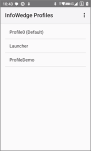

4. **Define the broadcast receiver.** Get the result of the command in the `resultBroadcastReceiver` and display it on the screen. This is done in the sample application in MainActivity.java:
    ```java
    private BroadcastReceiver resultBroadcastReceiver = new BroadcastReceiver() {
        @Override
        public void onReceive(Context context, Intent intent) {
            // The result of the command
            if (intent.hasExtra("COMMAND_IDENTIFIER") && intent.hasExtra("RESULT")) {
                ((TextView) findViewById(R.id.label_result)).setText(intent.getStringExtra("COMMAND_IDENTIFIER") + ": " + intent.getStringExtra("RESULT"));
            }
        }
    };
    ```

    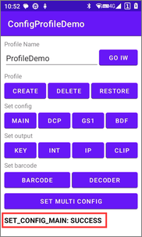

### Manage profiles

#### Create a new profile

create a new profile with the specified name.

```java
private void createProfile() {
    String profileName = ((TextView) findViewById(R.id.edit_profile_name)).getText().toString();
    if (profileName.isEmpty()) {
        ((TextView) findViewById(R.id.label_result)).setText("Profile name cannot be empty");
        return;
    }

    Intent i = new Intent();
    i.setAction("com.symbol.infowedge.api.ACTION");
    i.putExtra("com.symbol.infowedge.api.CREATE_PROFILE", profileName); // profile name
    i.putExtra("SEND_RESULT", "true");
    i.putExtra("COMMAND_IDENTIFIER", "CREATE_PROFILE");
    sendBroadcast(i);
}
```

 

#### Delete a specific profile

Delete a specific profile with the specified name.

```java
private void deleteProfile() {
    String profileName = ((TextView) findViewById(R.id.edit_profile_name)).getText().toString();
    if (profileName.isEmpty()) {
        ((TextView) findViewById(R.id.label_result)).setText("Profile name cannot be empty");
        return;
    }

    Intent i = new Intent();
    i.setAction("com.symbol.infowedge.api.ACTION");
    i.putExtra("com.symbol.infowedge.api.DELETE_PROFILE", profileName); // profile name
    i.putExtra("SEND_RESULT", "true");
    i.putExtra("COMMAND_IDENTIFIER", "DELETE_PROFILE");
    sendBroadcast(i);
}
```

 

#### Restore the default settings

Restore the default settings of the InfoWedge.

```java
private void restoreConfig() {
    new AlertDialog.Builder(this)
            .setMessage("Are you sure you want to restore the default configuration?")
            .setPositiveButton("Yes", (dialog, which) -> {
                Intent i = new Intent();
                i.setAction("com.symbol.infowedge.api.ACTION");
                i.putExtra("com.symbol.infowedge.api.RESTORE_CONFIG", "");
                i.putExtra("SEND_RESULT", "true");
                i.putExtra("COMMAND_IDENTIFIER", "RESTORE_CONFIG");
                sendBroadcast(i);
            })
            .setNegativeButton("No", (dialog, which) -> dialog.dismiss())
            .create().show();
}
```

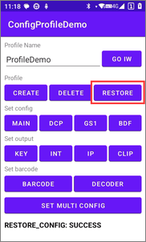 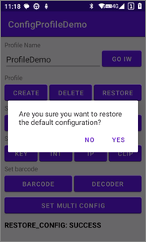

### Set the profile configurations

#### Set the main configurations

Set the main configurations of the profile.

```java
private void setConfigMain() {
    String profileName = ((TextView) findViewById(R.id.edit_profile_name)).getText().toString();
    if (profileName.isEmpty()) {
        ((TextView) findViewById(R.id.label_result)).setText("Profile name cannot be empty");
        return;
    }

    // main parameters
    Bundle bMain = new Bundle();
    bMain.putString("PROFILE_NAME", profileName);   // profile name
    bMain.putString("PROFILE_ENABLED", "true");     // enable the profile
    // CONFIG_MODE can be one of the following:
    // CREATE_IF_NOT_EXIST: create the profile if it does not exist
    // OVERWRITE: restore the profile to default first if it exists
    // UPDATE : merge the configuration with the existing one
    bMain.putString("CONFIG_MODE", "CREATE_IF_NOT_EXIST");  // Create the profile if it does not exist

    // associate the app with the profile
    Bundle bundleApp1 = new Bundle();
    bundleApp1.putString("PACKAGE_NAME", getPackageName());   // package name of the app
    bundleApp1.putStringArray("ACTIVITY_LIST", new String[]{getClass().getName()}); // activity list

    // associate another app with the profile
    Bundle bundleApp2 = new Bundle();
    bundleApp2.putString("PACKAGE_NAME", "com.android.settings");   // package name of the app
    bundleApp2.putStringArray("ACTIVITY_LIST", new String[]{"*"});  // * means all activities

    // put the app list into the main bundle
    bMain.putParcelableArray("APP_LIST", new Bundle[]{
            bundleApp1,
            bundleApp2
    });

    Intent i = new Intent();
    i.setAction("com.symbol.infowedge.api.ACTION");
    i.putExtra("com.symbol.infowedge.api.SET_CONFIG", bMain);
    i.putExtra("SEND_RESULT", "true");
    i.putExtra("COMMAND_IDENTIFIER", "SET_CONFIG_MAIN");
    sendBroadcast(i);
}
```

  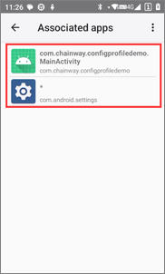

#### Set the DCP parameters

Set the DCP parameters of the profile.

```java
private void setConfigDcp() {
    String profileName = ((TextView) findViewById(R.id.edit_profile_name)).getText().toString();
    if (profileName.isEmpty()) {
        ((TextView) findViewById(R.id.label_result)).setText("Profile name cannot be empty");
        return;
    }

    // main parameters
    Bundle bMain = new Bundle();
    bMain.putString("PROFILE_NAME", profileName);   // profile name
    bMain.putString("PROFILE_ENABLED", "true");     // enable the profile
    bMain.putString("CONFIG_MODE", "UPDATE");       // merge the configuration with the existing one

    // set DCP configuration
    Bundle bConfig = new Bundle();
    bConfig.putString("PLUGIN_NAME", "DCP");    // plugin name
    bConfig.putString("RESET_CONFIG", "true");  // reset the dcp configuration to default first

    // set DCP parameters (if using default values, no need to set)
    Bundle bParams = new Bundle();
    bParams.putString("dcp_input_enabled", "true"); // enable DCP
    bParams.putString("dcp_start_in", "BUTTON");    // start in mode: FULLSCREEN, BUTTON, BUTTON_ONLY
    bParams.putString("dcp_pos_x", "50"); // set the X coordinate of the floating button position, with the farthest right coordinate being 0
    bParams.putString("dcp_pos_y", "50"); // set the Y coordinate of the floating button position, with the bottommost coordinate being 0

    // add the parameters to the configuration
    bConfig.putBundle("PARAM_LIST", bParams);
    bMain.putBundle("PLUGIN_CONFIG", bConfig);

    // send broadcast
    Intent i = new Intent();
    i.setAction("com.symbol.infowedge.api.ACTION");
    i.putExtra("com.symbol.infowedge.api.SET_CONFIG", bMain);
    i.putExtra("SEND_RESULT", "true");
    i.putExtra("COMMAND_IDENTIFIER", "SET_CONFIG_DCP");
    sendBroadcast(i);
}
```

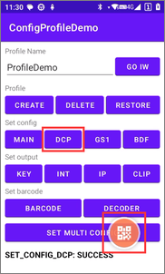 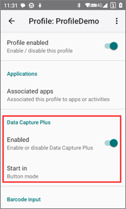

#### Set the GS1 parameters

Set the GS1 parameters of the profile.

```java
private void setConfigGs1() {
    String profileName = ((TextView) findViewById(R.id.edit_profile_name)).getText().toString();
    if (profileName.isEmpty()) {
        ((TextView) findViewById(R.id.label_result)).setText("Profile name cannot be empty");
        return;
    }

    // main parameters
    Bundle bMain = new Bundle();
    bMain.putString("PROFILE_NAME", profileName);   // profile name
    bMain.putString("PROFILE_ENABLED", "true");     // enable this profile
    bMain.putString("CONFIG_MODE", "UPDATE");       // merge the configuration with the existing profile

    // set GS1
    Bundle bConfig = new Bundle();
    bConfig.putString("PLUGIN_NAME", "GS1");    // plugin name
    bConfig.putString("RESET_CONFIG", "true");  // reset the GS1 configuration to default first

    // set GS1 parameters (if using default values, no need to set)
    Bundle bParams = new Bundle();
    bParams.putString("gs1_enabled", "true");       // enable GS1 code formatting
    bParams.putString("gs1_separate", "true");      // disable separate code format
    bParams.putString("gs1_new_line", "true");      // enable separate a new line
    bParams.putString("gs1_gs_format", "2");        // GS(0x1D) formatting: 0 - remove, 1 - reserve, 2 - replace with other string
    bParams.putString("gs1_gs_replace", "[G]");     // replace GS string

    // add the parameters to the configuration
    bConfig.putBundle("PARAM_LIST", bParams);
    bMain.putBundle("PLUGIN_CONFIG", bConfig);

    // send broadcast
    Intent i = new Intent();
    i.setAction("com.symbol.infowedge.api.ACTION");
    i.putExtra("com.symbol.infowedge.api.SET_CONFIG", bMain);
    i.putExtra("SEND_RESULT", "true");
    i.putExtra("COMMAND_IDENTIFIER", "SET_CONFIG_GS1");
    sendBroadcast(i);
}
```

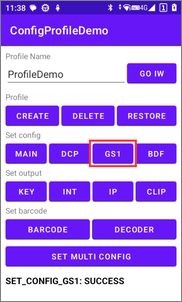 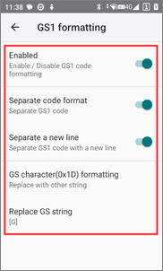

#### Set the BDF parameters

Set the BDF parameters of the profile.

```java
private void setConfigBdf() {
    String profileName = ((TextView) findViewById(R.id.edit_profile_name)).getText().toString();
    if (profileName.isEmpty()) {
        ((TextView) findViewById(R.id.label_result)).setText("Profile name cannot be empty");
        return;
    }

    // main parameters
    Bundle bMain = new Bundle();
    bMain.putString("PROFILE_NAME", profileName);   // profile name
    bMain.putString("PROFILE_ENABLED", "true");     // enable the profile
    bMain.putString("CONFIG_MODE", "UPDATE");       // merge the configuration with the existing profile

    // set BDF
    Bundle bConfig = new Bundle();
    bConfig.putString("PLUGIN_NAME", "BDF");    // plugin name
    bConfig.putString("RESET_CONFIG", "true");  // reset the BDF configuration to default first

    // set BDF parameters (if using default values, no need to set)
    Bundle bParams = new Bundle();
    bParams.putString("bdf_enabled", "true");       // enable BDF
    bParams.putString("bdf_prefix", "A");           // prefix to data
    bParams.putString("bdf_suffix", "B");           // suffix to data
    bParams.putString("bdf_send_tab", "true");      // send TAB key
    bParams.putString("bdf_send_enter", "true");    // send ENTER key
    bParams.putString("bdf_delete_start", "1");     // delete leading characters count
    bParams.putString("bdf_delete_end", "2");       // delete trailing characters count
    bParams.putString("bdf_delete_string", "DEL");  // delete specified string

    // add the parameters to the configuration
    bConfig.putBundle("PARAM_LIST", bParams);
    bMain.putBundle("PLUGIN_CONFIG", bConfig);

    // send broadcast
    Intent i = new Intent();
    i.setAction("com.symbol.infowedge.api.ACTION");
    i.putExtra("com.symbol.infowedge.api.SET_CONFIG", bMain);
    i.putExtra("SEND_RESULT", "true");
    i.putExtra("COMMAND_IDENTIFIER", "SET_CONFIG_BDF");
    sendBroadcast(i);
}
```

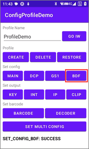 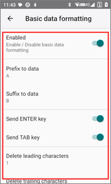

### Set output configurations

#### Set the keystroke output parameters

Set the keystroke output parameters of the profile.

```java
private void setKeystrokeOutput() {
    String profileName = ((TextView) findViewById(R.id.edit_profile_name)).getText().toString();
    if (profileName.isEmpty()) {
        ((TextView) findViewById(R.id.label_result)).setText("Profile name cannot be empty");
        return;
    }

    // main parameters
    Bundle bMain = new Bundle();
    bMain.putString("PROFILE_NAME", profileName);   // profile name
    bMain.putString("PROFILE_ENABLED", "true");     // enable the profile
    bMain.putString("CONFIG_MODE", "UPDATE");       // merge the configuration with the existing profile

    // set keystroke output
    Bundle bConfig = new Bundle();
    bConfig.putString("PLUGIN_NAME", "KEYSTROKE");  // plugin name
    bConfig.putString("RESET_CONFIG", "true");      // reset the keystroke output configuration to default first

    // set keystroke output parameters (if using default values, no need to set)
    Bundle bParams = new Bundle();
    bParams.putString("keystroke_output_enabled", "true");  // enable keystroke output
    bParams.putString("keystroke_output_type", "2");        // set keystroke type: 0 - Append on cursor, 1 - Simulate keystroke, 2 - Replace on cursor

    // add the parameters to the configuration
    bConfig.putBundle("PARAM_LIST", bParams);
    bMain.putBundle("PLUGIN_CONFIG", bConfig);

    // send broadcast
    Intent i = new Intent();
    i.setAction("com.symbol.infowedge.api.ACTION");
    i.putExtra("com.symbol.infowedge.api.SET_CONFIG", bMain);
    i.putExtra("SEND_RESULT", "true");
    i.putExtra("COMMAND_IDENTIFIER", "SET_KEYSTROKE_OUTPUT");
    sendBroadcast(i);
}
```

 

#### Set the intent output parameters

Set the intent output parameters of the profile.

```java
private void setIntentOutput() {
    String profileName = ((TextView) findViewById(R.id.edit_profile_name)).getText().toString();
    if (profileName.isEmpty()) {
        ((TextView) findViewById(R.id.label_result)).setText("Profile name cannot be empty");
        return;
    }

    // main parameters
    Bundle bMain = new Bundle();
    bMain.putString("PROFILE_NAME", profileName);   // profile name
    bMain.putString("PROFILE_ENABLED", "true");     // enable the profile
    bMain.putString("CONFIG_MODE", "UPDATE");       // merge the configuration with the existing profile

    // set intent configuration
    Bundle bConfig = new Bundle();
    bConfig.putString("PLUGIN_NAME", "INTENT"); // plugin name
    bConfig.putString("RESET_CONFIG", "true");  // reset the intent configuration to default first

    // set intent parameters (if using default values, no need to set)
    Bundle bParams = new Bundle();
    bParams.putString("intent_output_enabled", "true");         // enable intent output
    bParams.putString("intent_action", "com.infowedge.action"); // set the intent action
    bParams.putString("intent_data", "data");                   // set the intent data output name

    // add the parameters to the configuration
    bConfig.putBundle("PARAM_LIST", bParams);
    bMain.putBundle("PLUGIN_CONFIG", bConfig);

    // send broadcast
    Intent i = new Intent();
    i.setAction("com.symbol.infowedge.api.ACTION");
    i.putExtra("com.symbol.infowedge.api.SET_CONFIG", bMain);
    i.putExtra("SEND_RESULT", "true");
    i.putExtra("COMMAND_IDENTIFIER", "SET_INTENT_OUTPUT");
    sendBroadcast(i);
}
```

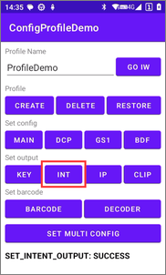 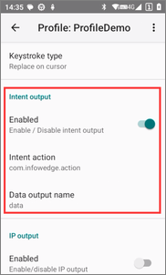

#### Set the IP output parameters

Set the IP output parameters of the profile.

```java
private void setIpOutput() {
    String profileName = ((TextView) findViewById(R.id.edit_profile_name)).getText().toString();
    if (profileName.isEmpty()) {
        ((TextView) findViewById(R.id.label_result)).setText("Profile name cannot be empty");
        return;
    }

    // main parameters
    Bundle bMain = new Bundle();
    bMain.putString("PROFILE_NAME", profileName);   // profile name
    bMain.putString("PROFILE_ENABLED", "true");     // enable the profile
    bMain.putString("CONFIG_MODE", "UPDATE");       // merge the configuration with the existing profile

    // set IP configuration
    Bundle bConfig = new Bundle();
    bConfig.putString("PLUGIN_NAME", "IP");    // plugin name
    bConfig.putString("RESET_CONFIG", "true"); // reset the IP configuration to default first

    // set IP parameters (if using default values, no need to set)
    Bundle bParams = new Bundle();
    bParams.putString("ip_output_enabled", "true"); // enable IP output
    bParams.putString("ip_output_protocol", "UDP"); // protocol: TCP, UDP
    bParams.putString("ip_output_address", "192.168.0.100"); // IP address
    bParams.putString("ip_output_port", "55555"); // port number

    // add the parameters to the configuration
    bConfig.putBundle("PARAM_LIST", bParams);
    bMain.putBundle("PLUGIN_CONFIG", bConfig);

    // send broadcast
    Intent i = new Intent();
    i.setAction("com.symbol.infowedge.api.ACTION");
    i.putExtra("com.symbol.infowedge.api.SET_CONFIG", bMain);
    i.putExtra("SEND_RESULT", "true");
    i.putExtra("COMMAND_IDENTIFIER", "SET_IP_OUTPUT");
    sendBroadcast(i);
}
```

 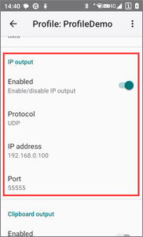

#### Set the clipboard output parameters

Set the clipboard output parameters of the profile.

```java
private void setClipboardOutput() {
    String profileName = ((TextView) findViewById(R.id.edit_profile_name)).getText().toString();
    if (profileName.isEmpty()) {
        ((TextView) findViewById(R.id.label_result)).setText("Profile name cannot be empty");
        return;
    }

    // main parameters
    Bundle bMain = new Bundle();
    bMain.putString("PROFILE_NAME", profileName);   // profile name
    bMain.putString("PROFILE_ENABLED", "true");     // enable the profile
    bMain.putString("CONFIG_MODE", "UPDATE");       // merge the configuration with the existing profile

    // set clipboard configuration
    Bundle bConfig = new Bundle();
    bConfig.putString("PLUGIN_NAME", "CLIPBOARD");  // plugin name
    bConfig.putString("RESET_CONFIG", "true");      // reset the clipboard configuration to default first

    // set clipboard parameters (if using default values, no need to set)
    Bundle bParams = new Bundle();
    bParams.putString("clipboard_output_enabled", "true");   // enable clipboard output

    // add the parameters to the configuration
    bConfig.putBundle("PARAM_LIST", bParams);
    bMain.putBundle("PLUGIN_CONFIG", bConfig);

    // send broadcast
    Intent i = new Intent();
    i.setAction("com.symbol.infowedge.api.ACTION");
    i.putExtra("com.symbol.infowedge.api.SET_CONFIG", bMain);;
    i.putExtra("SEND_RESULT", "true");
    i.putExtra("COMMAND_IDENTIFIER", "SET_INTENT_OUTPUT");
    sendBroadcast(i);
}
```

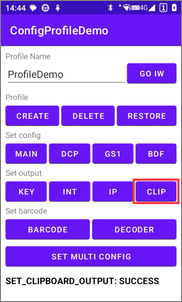 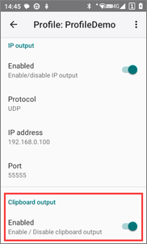

### Set barcode

#### Set the barcode parameters

Set the barcode parameters of the profile.

```java
private void setBarcode() {
    String profileName = ((TextView) findViewById(R.id.edit_profile_name)).getText().toString();
    if (profileName.isEmpty()) {
        ((TextView) findViewById(R.id.label_result)).setText("Profile name cannot be empty");
        return;
    }

    // main parameters
    Bundle bMain = new Bundle();
    bMain.putString("PROFILE_NAME", profileName);   // profile name
    bMain.putString("PROFILE_ENABLED", "true");     // enable the profile
    bMain.putString("CONFIG_MODE", "UPDATE");       // merge the configuration with the existing profile

    // set barcode configuration
    Bundle bConfig = new Bundle();
    bConfig.putString("PLUGIN_NAME", "BARCODE");    // plugin name
    bConfig.putString("RESET_CONFIG", "true");      // reset the barcode configuration to default first

    // set barcode parameters (if using default values, no need to set)
    Bundle bParams = new Bundle();
    bParams.putString("barcode_enabled", "true");   // enable barcode
    bParams.putString("success_audio_type", "1");   // success audio prompt: 0 - None, 1 - Du, 2 - Di
    bParams.putString("failure_audio", "true");     // play audio on failure
    bParams.putString("vibrate", "true");           // vibration on success
    bParams.putString("barcode_trigger_mode", "2"); // key trigger mode: 0 - Press and Release, 1 - Press and Continue, 2 - Trigger, 3 - Timed Release
    bParams.putString("charset_name", "UTF-8");     // character set name: Auto，UTF-8，GBK，GB18030，ISO-8859-1，Shift_JIS

    // add the parameters to the configuration
    bConfig.putBundle("PARAM_LIST", bParams);
    bMain.putBundle("PLUGIN_CONFIG", bConfig);

    // send broadcast
    Intent i = new Intent();
    i.setAction("com.symbol.infowedge.api.ACTION");
    i.putExtra("com.symbol.infowedge.api.SET_CONFIG", bMain);
    i.putExtra("SEND_RESULT", "true");
    i.putExtra("COMMAND_IDENTIFIER", "SET_BARCODE");
    sendBroadcast(i);
}
```

 

#### Set the decoder parameters

Set the decoder parameters of the profile.

```java
private void setDecoder() {
    String profileName = ((TextView) findViewById(R.id.edit_profile_name)).getText().toString();
    if (profileName.isEmpty()) {
        ((TextView) findViewById(R.id.label_result)).setText("Profile name cannot be empty");
        return;
    }

    // main parameters
    Bundle bMain = new Bundle();
    bMain.putString("PROFILE_NAME", profileName);   // profile name
    bMain.putString("PROFILE_ENABLED", "true");     // enable the profile
    bMain.putString("CONFIG_MODE", "UPDATE");       // merge the configuration with the existing profile

    // set barcode configuration
    Bundle bConfig = new Bundle();
    bConfig.putString("PLUGIN_NAME", "BARCODE");    // plugin name
    bConfig.putString("RESET_CONFIG", "true");      // reset the barcode configuration to default first

    // set barcode parameters (if using default values, no need to set)
    Bundle bParams = new Bundle();
    bParams.putString("decoder_code11", "true");    // enable Code11
    bParams.putString("decoder_code128", "false");  // disable Code128
    bParams.putString("decoder_code128_length1", "1");  // set Code128 length 1
    bParams.putString("decoder_code128_length2", "40"); // set Code128 length 2
    // if you want to set all the decoders in one go, use the following line
    // bParams.putString("decoder_all_symbology", "true");  // true - enable all, false - disable all, default - restore default settings

    // add the parameters to the configuration
    bConfig.putBundle("PARAM_LIST", bParams);
    bMain.putBundle("PLUGIN_CONFIG", bConfig);

    // send broadcast
    Intent i = new Intent();
    i.setAction("com.symbol.infowedge.api.ACTION");
    i.putExtra("com.symbol.infowedge.api.SET_CONFIG", bMain);
    i.putExtra("SEND_RESULT", "true");
    i.putExtra("COMMAND_IDENTIFIER", "SET_DECODER");
    sendBroadcast(i);
}
```

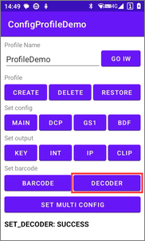 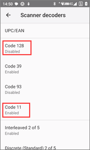 

### Set multiple configurations

Set multiple configurations of the profile in one go.

```java
private void setMultiConfig() {
    String profileName = ((TextView) findViewById(R.id.edit_profile_name)).getText().toString();
    if (profileName.isEmpty()) {
        ((TextView) findViewById(R.id.label_result)).setText("Profile name cannot be empty");
        return;
    }

    // main parameters
    Bundle bMain = new Bundle();
    bMain.putString("PROFILE_NAME", profileName);   // profile name
    bMain.putString("PROFILE_ENABLED", "true");     // enable the profile
    bMain.putString("CONFIG_MODE", "CREATE_IF_NOT_EXIST");  // create the profile if it does not exist
    bMain.putString("RESET_CONFIG", "true");  // reset the configuration to default first

    // associate the app with the profile
    Bundle bundleApp = new Bundle();
    bundleApp.putString("PACKAGE_NAME", getPackageName());   // package name of the app
    bundleApp.putStringArray("ACTIVITY_LIST", new String[]{"*"});  // * means all activities
    bMain.putParcelableArray("APP_LIST", new Bundle[] { bundleApp });

    // set barcode configuration
    Bundle bBarcodeConfig = new Bundle();
    bBarcodeConfig.putString("PLUGIN_NAME", "BARCODE"); // plugin name
    bBarcodeConfig.putString("RESET_CONFIG", "true");   // reset the barcode configuration to default first
    Bundle bBarcodeParams = new Bundle();
    bBarcodeParams.putString("barcode_trigger_mode", "1");  // key trigger mode: 0 - Press and Release, 1 - Press and Continue, 2 - Trigger, 3 - Timed Release
    bBarcodeParams.putString("failure_audio", "true");      // play audio on failure
    bBarcodeParams.putString("vibrate", "true");            // vibration on success
    bBarcodeParams.putString("decoder_code11", "true");     // enable Code11
    bBarcodeParams.putString("decoder_code128", "false");   // disable Code128
    bBarcodeConfig.putBundle("PARAM_LIST", bBarcodeParams);

    // set BDF configuration
    Bundle bBdfConfig = new Bundle();
    bBdfConfig.putString("PLUGIN_NAME", "BDF");     // plugin name
    bBdfConfig.putString("RESET_CONFIG", "true");   // reset the BDF configuration to default first
    Bundle bBdfParams = new Bundle();
    bBdfParams.putString("bdf_enabled", "true");    // enable BDF
    bBdfParams.putString("bdf_prefix", "A");        // prefix to data
    bBdfConfig.putBundle("PARAM_LIST", bBdfParams);

    // set intent configuration
    Bundle bIntentConfig = new Bundle();
    bIntentConfig.putString("PLUGIN_NAME", "INTENT");   // plugin name
    bIntentConfig.putString("RESET_CONFIG", "true");    // reset the intent configuration to default first
    Bundle bIntentParams = new Bundle();
    bIntentParams.putString("intent_output_enabled", "true");   // enable intent output
    bIntentConfig.putBundle("PARAM_LIST", bIntentParams);

    // set keystroke output
    Bundle bKeystrokeConfig = new Bundle();
    bKeystrokeConfig.putString("PLUGIN_NAME", "KEYSTROKE"); // plugin name
    bKeystrokeConfig.putString("RESET_CONFIG", "true");     // reset the keystroke output configuration to default first
    Bundle bKeystrokeParams = new Bundle();
    bKeystrokeParams.putString("keystroke_output_enabled", "true"); // enable keystroke output
    bKeystrokeParams.putString("keystroke_output_type", "2");       // set keystroke type: 0 - Append on cursor, 1 - Simulate keystroke, 2 - Replace on cursor
    bKeystrokeConfig.putBundle("PARAM_LIST", bKeystrokeParams);

    // set clipboard configuration
    Bundle bClipboardConfig = new Bundle();
    bClipboardConfig.putString("PLUGIN_NAME", "CLIPBOARD"); // plugin name
    bClipboardConfig.putString("RESET_CONFIG", "true");     // reset the clipboard configuration to default first
    Bundle bClipboardParams = new Bundle();
    bClipboardParams.putString("clipboard_output_enabled", "true");   // enable clipboard output
    bClipboardConfig.putBundle("PARAM_LIST", bClipboardParams);

    // add plugin configurations to the main bundle, DCP, GS1, and IP are not included. they keep the default values
    ArrayList<Bundle> bundlePluginConfig = new ArrayList<>();
    bundlePluginConfig.add(bBarcodeConfig);
    bundlePluginConfig.add(bBdfConfig);
    bundlePluginConfig.add(bIntentConfig);
    bundlePluginConfig.add(bKeystrokeConfig);
    bundlePluginConfig.add(bClipboardConfig);
    bMain.putParcelableArrayList("PLUGIN_CONFIG", bundlePluginConfig);

    // send broadcast
    Intent i = new Intent();
    i.setAction("com.symbol.infowedge.api.ACTION");
    i.putExtra("com.symbol.infowedge.api.SET_CONFIG", bMain);
    i.putExtra("SEND_RESULT", "true");
    i.putExtra("COMMAND_IDENTIFIER", "SET_MULTI_CONFIG");
    sendBroadcast(i);
}
```