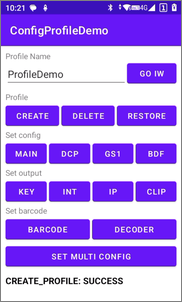
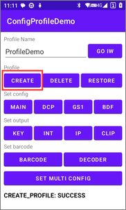

# 修改配置演示

> 本演示项目展示如何使用 API 修改 InfoWedge 配置文件。

[](README.md)

## 演示环境

- InfoWedge - v1.49
- 设备 - MC62
- 扫描头 - SE4710

## 概述

此示例应用程序演示了如何使用 InfoWedge API 配置 InfoWedge 配置文件。



1. 点击 `GO IW` 按钮跳转到 InfoWedge 应用程序。
2. 命令的执行结果将显示在屏幕底部。
3. **管理配置文件**
    - [点击 CREATE 按钮创建一个新配置文件。](#创建一个新配置)
    - [点击 DELETE 按钮删除指定的配置文件。](#删除指定的配置)
    - [点击 RESTORE 按钮恢复 InfoWedge 默认设置。](#恢复默认设置)
4. **设置配置文件参数**
    - [点击 MAIN 按钮设置主要配置。](#设置主要配置)
    - [点击 DCP 按钮设置 DCP 参数。](#设置-dcp-参数)
    - [点击 BDF 按钮设置 BDF 参数。](#设置-bdf-参数)
5. **设置输出配置**
    - [点击 KEY 按钮设置按键输出参数。](#设置按键输出参数)
    - [点击 INT 按钮设置 Intent 输出参数。](#设置-intent-输出参数)
    - [点击 IP 按钮设置 IP 输出参数。](#设置-IP-输出参数)
    - [点击 CLIP 按钮设置剪贴板输出参数。](#设置剪贴板输出参数)
6. **设置条码**
    - [点击 BARCODE 按钮设置条码参数。](#设置条码参数)
    - [点击 DECODER 按钮设置解码器参数。](#设置解码器参数)
7. **设置多个配置**
    - [点击 SET MULTI CONFIG 按钮一次性设置多个配置。](#设置多个配置)

## 示例代码说明

### 概述

1. **注册广播接收器并过滤结果。** 这是在示例应用程序的 `onCreate()` 方法中完成的：
    ```java
    // 注册广播接收器并过滤结果
    IntentFilter filter = new IntentFilter();
    filter.addAction("com.symbol.datawedge.api.RESULT_ACTION");
    filter.addCategory("android.intent.category.DEFAULT");
    registerReceiver(resultBroadcastReceiver, filter);
    ```
2. **处理按钮点击事件。** 这是在示例应用程序的 `onCreate()` 方法中完成的：
    ```java
    findViewById(R.id.button_go_iw).setOnClickListener(v -> goInfoWedge());
    findViewById(R.id.button_create_profile).setOnClickListener(v -> createProfile());
    findViewById(R.id.button_delete_profile).setOnClickListener(v -> deleteProfile());
    findViewById(R.id.button_restore_config).setOnClickListener(v -> restoreConfig());
    // 其他按钮 ...
    ```
3. **定义按钮点击处理程序。** 这是在示例应用程序的 MainActivity.java 中完成的：
    ```java
    private void goInfoWedge() {
        Intent i = new Intent();
        i.setClassName("com.rscja.infowedge", "com.rscja.infowedge.ui.MainActivity");
        startActivity(i);
    }
    // 其他方法 ...
    ```
    点击 `GO IW` 按钮进入 InfoWedge 应用程序，便于检查 InfoWedge 应用程序中的配置。

     

4. **定义广播接收器。** 在 `resultBroadcastReceiver` 中获取命令的结果并显示在屏幕上。这是在示例应用程序的 MainActivity.java 中完成的：
    ```java
    private BroadcastReceiver resultBroadcastReceiver = new BroadcastReceiver() {
        @Override
        public void onReceive(Context context, Intent intent) {
            // 命令的结果
            if (intent.hasExtra("COMMAND_IDENTIFIER") && intent.hasExtra("RESULT")) {
                ((TextView) findViewById(R.id.label_result)).setText(intent.getStringExtra("COMMAND_IDENTIFIER") + ": " + intent.getStringExtra("RESULT"));
            }
        }
    };
    ```

    

### 管理配置文件

#### 创建一个新配置

创建一个指定名称的新配置。

```java
private void createProfile() {
    String profileName = ((TextView) findViewById(R.id.edit_profile_name)).getText().toString();
    if (profileName.isEmpty()) {
        ((TextView) findViewById(R.id.label_result)).setText("配置文件名称不能为空");
        return;
    }

    Intent i = new Intent();
    i.setAction("com.symbol.infowedge.api.ACTION");
    i.putExtra("com.symbol.infowedge.api.CREATE_PROFILE", profileName); // 配置名称
    i.putExtra("SEND_RESULT", "true");
    i.putExtra("COMMAND_IDENTIFIER", "CREATE_PROFILE");
    sendBroadcast(i);
}
```

 

#### 删除指定的配置

删除指定名称的配置。

```java
private void deleteProfile() {
    String profileName = ((TextView) findViewById(R.id.edit_profile_name)).getText().toString();
    if (profileName.isEmpty()) {
        ((TextView) findViewById(R.id.label_result)).setText("配置文件名称不能为空");
        return;
    }

    Intent i = new Intent();
    i.setAction("com.symbol.infowedge.api.ACTION");
    i.putExtra("com.symbol.infowedge.api.DELETE_PROFILE", profileName); // 配置名称
    i.putExtra("SEND_RESULT", "true");
    i.putExtra("COMMAND_IDENTIFIER", "DELETE_PROFILE");
    sendBroadcast(i);
}
```

 

#### 恢复默认设置

恢复 InfoWedge 的默认设置。

```java
private void restoreConfig() {
    new AlertDialog.Builder(this)
            .setMessage("Are you sure you want to restore the default configuration?")
            .setPositiveButton("Yes", (dialog, which) -> {
                Intent i = new Intent();
                i.setAction("com.symbol.infowedge.api.ACTION");
                i.putExtra("com.symbol.infowedge.api.RESTORE_CONFIG", "");
                i.putExtra("SEND_RESULT", "true");
                i.putExtra("COMMAND_IDENTIFIER", "RESTORE_CONFIG");
                sendBroadcast(i);
            })
            .setNegativeButton("No", (dialog, which) -> dialog.dismiss())
            .create().show();
}
```

 

### 设置配置参数

#### 设置主要配置。

设置配置中的主要配置。

```java
private void setConfigMain() {
    String profileName = ((TextView) findViewById(R.id.edit_profile_name)).getText().toString();
    if (profileName.isEmpty()) {
        ((TextView) findViewById(R.id.label_result)).setText("配置文件名称不能为空");
        return;
    }

    // 主要参数
    Bundle bMain = new Bundle();
    bMain.putString("PROFILE_NAME", profileName);   // 配置名称
    bMain.putString("PROFILE_ENABLED", "true");     // 启用配置
    // CONFIG_MODE 可以是以下之一：
    // CREATE_IF_NOT_EXIST: 如果配置文件不存在则创建
    // OVERWRITE: 如果配置文件存在则先恢复默认
    // UPDATE : 与现有配置合并
    bMain.putString("CONFIG_MODE", "CREATE_IF_NOT_EXIST");  // 如果配置文件不存在则创建

    // 将应用程序与配置关联
    Bundle bundleApp1 = new Bundle();
    bundleApp1.putString("PACKAGE_NAME", getPackageName());   // 应用程序包名
    bundleApp1.putStringArray("ACTIVITY_LIST", new String[]{getClass().getName()}); // 活动列表

    // 将另一个应用程序与配置文件关联
    Bundle bundleApp2 = new Bundle();
    bundleApp2.putString("PACKAGE_NAME", "com.android.settings");   // 应用程序包名
    bundleApp2.putStringArray("ACTIVITY_LIST", new String[]{"*"});  // * 表示所有活动

    // 将应用程序列表放入主要包中
    bMain.putParcelableArray("APP_LIST", new Bundle[]{
            bundleApp1,
            bundleApp2
    });

    Intent i = new Intent();
    i.setAction("com.symbol.infowedge.api.ACTION");
    i.putExtra("com.symbol.infowedge.api.SET_CONFIG", bMain);
    i.putExtra("SEND_RESULT", "true");
    i.putExtra("COMMAND_IDENTIFIER", "SET_CONFIG_MAIN");
    sendBroadcast(i);
}
```

  

#### 设置 DCP 参数

设置配置中的 DCP 参数。

```java
private void setConfigDcp() {
    String profileName = ((TextView) findViewById(R.id.edit_profile_name)).getText().toString();
    if (profileName.isEmpty()) {
        ((TextView) findViewById(R.id.label_result)).setText("配置文件名称不能为空");
        return;
    }

    // 主要参数
    Bundle bMain = new Bundle();
    bMain.putString("PROFILE_NAME", profileName);   // 配置文件名称
    bMain.putString("PROFILE_ENABLED", "true");     // 启用配置文件
    bMain.putString("CONFIG_MODE", "UPDATE");       // 与现有配置合并

    // 设置 DCP 配置
    Bundle bConfig = new Bundle();
    bConfig.putString("PLUGIN_NAME", "DCP");    // 插件名称
    bConfig.putString("RESET_CONFIG", "true");  // 先恢复 DCP 配置为默认

    // 设置 DCP 参数（如果使用默认值，则无需设置）
    Bundle bParams = new Bundle();
    bParams.putString("dcp_input_enabled", "true"); // 启用 DCP
    bParams.putString("dcp_start_in", "BUTTON");    // 启动模式：FULLSCREEN，BUTTON，BUTTON_ONLY
    bParams.putString("dcp_pos_x", "50"); // 设置浮动按钮位置的 X 坐标，最右边的坐标为 0
    bParams.putString("dcp_pos_y", "50"); // 设置浮动按钮位置的 Y 坐标，最底部的坐标为 0

    // 将参数添加到配置中
    bConfig.putBundle("PARAM_LIST", bParams);
    bMain.putBundle("PLUGIN_CONFIG", bConfig);

    // 发送广播
    Intent i = new Intent();
    i.setAction("com.symbol.infowedge.api.ACTION");
    i.putExtra("com.symbol.infowedge.api.SET_CONFIG", bMain);
    i.putExtra("SEND_RESULT", "true");
    i.putExtra("COMMAND_IDENTIFIER", "SET_CONFIG_DCP");
    sendBroadcast(i);
}
```

 

#### 设置 GS1 参数

设置配置中的 GS1 参数。

```java
private void setConfigGs1() {
    String profileName = ((TextView) findViewById(R.id.edit_profile_name)).getText().toString();
    if (profileName.isEmpty()) {
        ((TextView) findViewById(R.id.label_result)).setText("配置文件名称不能为空");
        return;
    }

    // 主要参数
    Bundle bMain = new Bundle();
    bMain.putString("PROFILE_NAME", profileName);   // 配置文件名称
    bMain.putString("PROFILE_ENABLED", "true");     // 启用此配置文件
    bMain.putString("CONFIG_MODE", "UPDATE");       // 与现有配置合并

    // 设置 GS1
    Bundle bConfig = new Bundle();
    bConfig.putString("PLUGIN_NAME", "GS1");    // 插件名称
    bConfig.putString("RESET_CONFIG", "true");  // 先恢复 GS1 配置为默认

    // 设置 GS1 参数（如果使用默认值，则无需设置）
    Bundle bParams = new Bundle();
    bParams.putString("gs1_enabled", "true");       // 启用 GS1 编码格式化
    bParams.putString("gs1_separate", "true");      // 分隔解码
    bParams.putString("gs1_new_line", "true");      // 分隔换行
    bParams.putString("gs1_gs_format", "2");        // GS(0x1D) 处理：0 - 删除, 1 - 保留, 2 - 替换成其他字符串
    bParams.putString("gs1_gs_replace", "[G]");     // 替换 GS 字符串

    // 将参数添加到配置中
    bConfig.putBundle("PARAM_LIST", bParams);
    bMain.putBundle("PLUGIN_CONFIG", bConfig);

    // 发送广播
    Intent i = new Intent();
    i.setAction("com.symbol.infowedge.api.ACTION");
    i.putExtra("com.symbol.infowedge.api.SET_CONFIG", bMain);
    i.putExtra("SEND_RESULT", "true");
    i.putExtra("COMMAND_IDENTIFIER", "SET_CONFIG_GS1");
    sendBroadcast(i);
}
```

 

#### 设置 BDF 参数

设置配置中的 BDF 参数。

```java
private void setConfigBdf() {
    String profileName = ((TextView) findViewById(R.id.edit_profile_name)).getText().toString();
    if (profileName.isEmpty()) {
        ((TextView) findViewById(R.id.label_result)).setText("配置文件名称不能为空");
        return;
    }

    // 主要参数
    Bundle bMain = new Bundle();
    bMain.putString("PROFILE_NAME", profileName);   // 配置文件名称
    bMain.putString("PROFILE_ENABLED", "true");     // 启用配置文件
    bMain.putString("CONFIG_MODE", "UPDATE");       // 与现有配置合并

    // 设置 BDF
    Bundle bConfig = new Bundle();
    bConfig.putString("PLUGIN_NAME", "BDF");    // 插件名称
    bConfig.putString("RESET_CONFIG", "true");  // 先恢复 BDF 配置为默认

    // 设置 BDF 参数（如果使用默认值，则无需设置）
    Bundle bParams = new Bundle();
    bParams.putString("bdf_enabled", "true");       // 启用 BDF
    bParams.putString("bdf_prefix", "A");           // 添加前缀
    bParams.putString("bdf_suffix", "B");           // 添加后缀
    bParams.putString("bdf_send_tab", "true");      // 发送 TAB 键
    bParams.putString("bdf_send_enter", "true");    // 发送 ENTER 键
    bParams.putString("bdf_delete_start", "1");     // 删除起始字符数
    bParams.putString("bdf_delete_end", "2");       // 删除结束字符数
    bParams.putString("bdf_delete_string", "DEL");  // 删除内容

    // 将参数添加到配置中
    bConfig.putBundle("PARAM_LIST", bParams);
    bMain.putBundle("PLUGIN_CONFIG", bConfig);

    // 发送广播
    Intent i = new Intent();
    i.setAction("com.symbol.infowedge.api.ACTION");
    i.putExtra("com.symbol.infowedge.api.SET_CONFIG", bMain);
    i.putExtra("SEND_RESULT", "true");
    i.putExtra("COMMAND_IDENTIFIER", "SET_CONFIG_BDF");
    sendBroadcast(i);
}
```

 

### 设置输出配置

#### 设置按键输出参数

设置配置中的按键输出参数。

```java
private void setKeystrokeOutput() {
    String profileName = ((TextView) findViewById(R.id.edit_profile_name)).getText().toString();
    if (profileName.isEmpty()) {
        ((TextView) findViewById(R.id.label_result)).setText("配置文件名称不能为空");
        return;
    }

    // 主要参数
    Bundle bMain = new Bundle();
    bMain.putString("PROFILE_NAME", profileName);   // 配置文件名称
    bMain.putString("PROFILE_ENABLED", "true");     // 启用配置文件
    bMain.putString("CONFIG_MODE", "UPDATE");       // 与现有配置合并

    // 设置按键输出
    Bundle bConfig = new Bundle();
    bConfig.putString("PLUGIN_NAME", "KEYSTROKE");  // 插件名称
    bConfig.putString("RESET_CONFIG", "true");      // 先恢复按键输出配置为默认

    // 设置按键输出参数（如果使用默认值，则无需设置）
    Bundle bParams = new Bundle();
    bParams.putString("keystroke_output_enabled", "true");  // 启用按键输出
    bParams.putString("keystroke_output_type", "2");        // 设置按键输出方式: 0 - 输出至光标位置，1 - 模拟键盘输出，2 - 输出并覆盖光标位置

    // 将参数添加到配置中
    bConfig.putBundle("PARAM_LIST", bParams);
    bMain.putBundle("PLUGIN_CONFIG", bConfig);

    // 发送广播
    Intent i = new Intent();
    i.setAction("com.symbol.infowedge.api.ACTION");
    i.putExtra("com.symbol.infowedge.api.SET_CONFIG", bMain);
    i.putExtra("SEND_RESULT", "true");
    i.putExtra("COMMAND_IDENTIFIER", "SET_KEYSTROKE_OUTPUT");
    sendBroadcast(i);
}
```

 

#### 设置 Intent 输出参数

设置配置中的 Intent 输出参数。

```java
private void setIntentOutput() {
    String profileName = ((TextView) findViewById(R.id.edit_profile_name)).getText().toString();
    if (profileName.isEmpty()) {
        ((TextView) findViewById(R.id.label_result)).setText("配置文件名称不能为空");
        return;
    }

    // 主要参数
    Bundle bMain = new Bundle();
    bMain.putString("PROFILE_NAME", profileName);   // 配置文件名称
    bMain.putString("PROFILE_ENABLED", "true");     // 启用配置文件
    bMain.putString("CONFIG_MODE", "UPDATE");       // 将配置与现有配置文件合并

    // 设置 Intent 配置
    Bundle bConfig = new Bundle();
    bConfig.putString("PLUGIN_NAME", "INTENT"); // 插件名称
    bConfig.putString("RESET_CONFIG", "true");  // 首先将 Intent 配置重置为默认值

    // 设置 Intent 参数（如果使用默认值，则无需设置）
    Bundle bParams = new Bundle();
    bParams.putString("intent_output_enabled", "true");         // 启用广播输出
    bParams.putString("intent_action", "com.infowedge.action"); // 设置广播名称
    bParams.putString("intent_data", "data");                   // 设置数据名称

    // 将参数添加到配置中
    bConfig.putBundle("PARAM_LIST", bParams);
    bMain.putBundle("PLUGIN_CONFIG", bConfig);

    // 发送广播
    Intent i = new Intent();
    i.setAction("com.symbol.infowedge.api.ACTION");
    i.putExtra("com.symbol.infowedge.api.SET_CONFIG", bMain);
    i.putExtra("SEND_RESULT", "true");
    i.putExtra("COMMAND_IDENTIFIER", "SET_INTENT_OUTPUT");
    sendBroadcast(i);
}
```

 

#### 设置 IP 输出参数

设置配置中的 IP 输出参数。

```java
private void setIpOutput() {
    String profileName = ((TextView) findViewById(R.id.edit_profile_name)).getText().toString();
    if (profileName.isEmpty()) {
        ((TextView) findViewById(R.id.label_result)).setText("配置文件名称不能为空");
        return;
    }

    // 主要参数
    Bundle bMain = new Bundle();
    bMain.putString("PROFILE_NAME", profileName);   // 配置文件名称
    bMain.putString("PROFILE_ENABLED", "true");     // 启用配置文件
    bMain.putString("CONFIG_MODE", "UPDATE");       // 将配置与现有配置文件合并

    // 设置 IP 配置
    Bundle bConfig = new Bundle();
    bConfig.putString("PLUGIN_NAME", "IP");    // 插件名称
    bConfig.putString("RESET_CONFIG", "true"); // 首先将 IP 配置重置为默认值

    // 设置 IP 参数（如果使用默认值，则无需设置）
    Bundle bParams = new Bundle();
    bParams.putString("ip_output_enabled", "true"); // 启用 IP 输出
    bParams.putString("ip_output_protocol", "UDP"); // 协议：TCP，UDP
    bParams.putString("ip_output_address", "192.168.0.100"); // IP 地址
    bParams.putString("ip_output_port", "55555"); // 端口号

    // 将参数添加到配置中
    bConfig.putBundle("PARAM_LIST", bParams);
    bMain.putBundle("PLUGIN_CONFIG", bConfig);

    // 发送广播
    Intent i = new Intent();
    i.setAction("com.symbol.infowedge.api.ACTION");
    i.putExtra("com.symbol.infowedge.api.SET_CONFIG", bMain);
    i.putExtra("SEND_RESULT", "true");
    i.putExtra("COMMAND_IDENTIFIER", "SET_IP_OUTPUT");
    sendBroadcast(i);
}
```

 

#### 设置剪贴板输出参数

设置配置中的剪贴板输出参数。

```java
private void setClipboardOutput() {
    String profileName = ((TextView) findViewById(R.id.edit_profile_name)).getText().toString();
    if (profileName.isEmpty()) {
        ((TextView) findViewById(R.id.label_result)).setText("配置文件名称不能为空");
        return;
    }

    // 主要参数
    Bundle bMain = new Bundle();
    bMain.putString("PROFILE_NAME", profileName);   // 配置文件名称
    bMain.putString("PROFILE_ENABLED", "true");     // 启用配置文件
    bMain.putString("CONFIG_MODE", "UPDATE");       // 将配置与现有配置文件合并

    // 设置剪贴板配置
    Bundle bConfig = new Bundle();
    bConfig.putString("PLUGIN_NAME", "CLIPBOARD");  // 插件名称
    bConfig.putString("RESET_CONFIG", "true");      // 首先将剪贴板配置重置为默认值

    // 设置剪贴板参数（如果使用默认值，则无需设置）
    Bundle bParams = new Bundle();
    bParams.putString("clipboard_output_enabled", "true");   // 启用剪贴板输出

    // 将参数添加到配置中
    bConfig.putBundle("PARAM_LIST", bParams);
    bMain.putBundle("PLUGIN_CONFIG", bConfig);

    // 发送广播
    Intent i = new Intent();
    i.setAction("com.symbol.infowedge.api.ACTION");
    i.putExtra("com.symbol.infowedge.api.SET_CONFIG", bMain);
    i.putExtra("SEND_RESULT", "true");
    i.putExtra("COMMAND_IDENTIFIER", "SET_CLIPBOARD_OUTPUT");
    sendBroadcast(i);
}
```

 

### 设置条码

#### 设置条码参数

设置配置中的条码参数。

```java
private void setBarcode() {
    String profileName = ((TextView) findViewById(R.id.edit_profile_name)).getText().toString();
    if (profileName.isEmpty()) {
        ((TextView) findViewById(R.id.label_result)).setText("配置文件名称不能为空");
        return;
    }

    // 主要参数
    Bundle bMain = new Bundle();
    bMain.putString("PROFILE_NAME", profileName);   // 配置文件名称
    bMain.putString("PROFILE_ENABLED", "true");     // 启用配置文件
    bMain.putString("CONFIG_MODE", "UPDATE");       // 将配置与现有配置文件合并

    // 设置条码配置
    Bundle bConfig = new Bundle();
    bConfig.putString("PLUGIN_NAME", "BARCODE");    // 插件名称
    bConfig.putString("RESET_CONFIG", "true");      // 首先将条码配置重置为默认值

    // 设置条码参数（如果使用默认值，则无需设置）
    Bundle bParams = new Bundle();
    bParams.putString("barcode_enabled", "true");   // 启用扫码功能
    bParams.putString("success_audio_type", "1");   // 成功音频提示：0 - 无，1 - 嘟，2 - 嘀
    bParams.putString("failure_audio", "true");     // 扫描失败提示音
    bParams.putString("vibrate", "true");           // 扫描振动提示
    bParams.putString("barcode_trigger_mode", "2"); // 按键触发模式：0 - 单次扫码，1 - 连续扫码，2 - 按住扫码，3 - 瞄准扫码
    bParams.putString("charset_name", "UTF-8");     // 字符集：Auto，UTF-8，GBK，GB18030，ISO-8859-1，Shift_JIS

    // 将参数添加到配置中
    bConfig.putBundle("PARAM_LIST", bParams);
    bMain.putBundle("PLUGIN_CONFIG", bConfig);

    // 发送广播
    bConfig.putBundle("PARAM_LIST", bParams);
    bMain.putBundle("PLUGIN_CONFIG", bConfig);

    // send broadcast
    Intent i = new Intent();
    i.setAction("com.symbol.infowedge.api.ACTION");
    i.putExtra("com.symbol.infowedge.api.SET_CONFIG", bMain);
    i.putExtra("SEND_RESULT", "true");
    i.putExtra("COMMAND_IDENTIFIER", "SET_BARCODE");
    sendBroadcast(i);
}
```

 

#### 设置解码器参数

设置配置中的解码器参数。

```java
private void setDecoder() {
    String profileName = ((TextView) findViewById(R.id.edit_profile_name)).getText().toString();
    if (profileName.isEmpty()) {
        ((TextView) findViewById(R.id.label_result)).setText("配置文件名称不能为空");
        return;
    }

    // 主要参数
    Bundle bMain = new Bundle();
    bMain.putString("PROFILE_NAME", profileName);   // 配置文件名称
    bMain.putString("PROFILE_ENABLED", "true");     // 启用配置文件
    bMain.putString("CONFIG_MODE", "UPDATE");       // 将配置与现有配置文件合并

    // 设置条码配置
    Bundle bConfig = new Bundle();
    bConfig.putString("PLUGIN_NAME", "BARCODE");    // 插件名称
    bConfig.putString("RESET_CONFIG", "true");      // 首先将条码配置重置为默认值

    // 设置条码参数（如果使用默认值，则无需设置）
    Bundle bParams = new Bundle();
    bParams.putString("decoder_code11", "true");    // 启用 Code11
    bParams.putString("decoder_code128", "false");  // 禁用 Code128
    bParams.putString("decoder_code128_length1", "1");  // 设置 Code128 长度 1
    bParams.putString("decoder_code128_length2", "40"); // 设置 Code128 长度 2
    // 如果你想一次性设置所有解码器，请使用以下代码：
    // bParams.putString("decoder_all_symbology", "true");  // true - 启用所有，false - 禁用所有，default - 恢复默认设置

    // 将参数添加到配置中
    bConfig.putBundle("PARAM_LIST", bParams);
    bMain.putBundle("PLUGIN_CONFIG", bConfig);

    // 发送广播
    Intent i = new Intent();
    i.setAction("com.symbol.infowedge.api.ACTION");
    i.putExtra("com.symbol.infowedge.api.SET_CONFIG", bMain);
    i.putExtra("SEND_RESULT", "true");
    i.putExtra("COMMAND_IDENTIFIER", "SET_DECODER");
    sendBroadcast(i);
}
```

  

### 设置多个配置

一次性设置配置文件的多个配置。

```java
private void setMultiConfig() {
    String profileName = ((TextView) findViewById(R.id.edit_profile_name)).getText().toString();
    if (profileName.isEmpty()) {
        ((TextView) findViewById(R.id.label_result)).setText("配置文件名称不能为空");
        return;
    }

    // 主要参数
    Bundle bMain = new Bundle();
    bMain.putString("PROFILE_NAME", profileName);   // 配置文件名称
    bMain.putString("PROFILE_ENABLED", "true");     // 启用配置文件
    bMain.putString("CONFIG_MODE", "CREATE_IF_NOT_EXIST");  // 如果配置文件不存在则创建
    bMain.putString("RESET_CONFIG", "true");  // 首先将配置重置为默认值

    // 将应用程序与配置文件关联
    Bundle bundleApp = new Bundle();
    bundleApp.putString("PACKAGE_NAME", getPackageName());   // 应用程序的包名
    bundleApp.putStringArray("ACTIVITY_LIST", new String[]{"*"});  // * 表示所有活动
    bMain.putParcelableArray("APP_LIST", new Bundle[] { bundleApp });

    // 设置条码配置
    Bundle bBarcodeConfig = new Bundle();
    bBarcodeConfig.putString("PLUGIN_NAME", "BARCODE"); // 插件名称
    bBarcodeConfig.putString("RESET_CONFIG", "true");   // 首先将条码配置重置为默认值
    Bundle bBarcodeParams = new Bundle();
    bBarcodeParams.putString("barcode_trigger_mode", "1");  // 按键触发模式：0 - 单次扫码，1 - 连续扫码，2 - 按住扫码，3 - 瞄准扫码
    bBarcodeParams.putString("failure_audio", "true");      // 扫描失败提示音
    bBarcodeParams.putString("vibrate", "true");            // 扫描振动提示
    bBarcodeParams.putString("decoder_code11", "true");     // 启用 Code11
    bBarcodeParams.putString("decoder_code128", "false");   // 禁用 Code128
    bBarcodeConfig.putBundle("PARAM_LIST", bBarcodeParams);

    // 设置 BDF 配置
    Bundle bBdfConfig = new Bundle();
    bBdfConfig.putString("PLUGIN_NAME", "BDF");     // 插件名称
    bBdfConfig.putString("RESET_CONFIG", "true");   // 首先将 BDF 配置重置为默认值
    Bundle bBdfParams = new Bundle();
    bBdfParams.putString("bdf_enabled", "true");    // 启用 BDF
    bBdfParams.putString("bdf_prefix", "A");        // 数据前缀
    bBdfConfig.putBundle("PARAM_LIST", bBdfParams);

    // 设置 Intent 配置
    Bundle bIntentConfig = new Bundle();
    bIntentConfig.putString("PLUGIN_NAME", "INTENT");   // 插件名称
    bIntentConfig.putString("RESET_CONFIG", "true");    // 首先将 Intent 配置重置为默认值
    Bundle bIntentParams = new Bundle();
    bIntentParams.putString("intent_output_enabled", "true");   // 启用 Intent 输出
    bIntentConfig.putBundle("PARAM_LIST", bIntentParams);

    // 设置按键输出
    Bundle bKeystrokeConfig = new Bundle();
    bKeystrokeConfig.putString("PLUGIN_NAME", "KEYSTROKE"); // 插件名称
    bKeystrokeConfig.putString("RESET_CONFIG", "true");     // 首先将按键输出配置重置为默认值
    Bundle bKeystrokeParams = new Bundle();
    bKeystrokeParams.putString("keystroke_output_enabled", "true"); // 启用按键输出
    bKeystrokeParams.putString("keystroke_output_type", "2");       // 设置按键输出方式: 0 - 输出至光标位置，1 - 模拟键盘输出，2 - 输出并覆盖光标位置
    bKeystrokeConfig.putBundle("PARAM_LIST", bKeystrokeParams);

    // 设置剪贴板配置
    Bundle bClipboardConfig = new Bundle();
    bClipboardConfig.putString("PLUGIN_NAME", "CLIPBOARD"); // 插件名称
    bClipboardConfig.putString("RESET_CONFIG", "true");     // 首先将剪贴板配置重置为默认值
    Bundle bClipboardParams = new Bundle();
    bClipboardParams.putString("clipboard_output_enabled", "true");   // 启用剪贴板输出
    bClipboardConfig.putBundle("PARAM_LIST", bClipboardParams);

    // 将插件配置添加到主包中，DCP、GS1 和 IP 不包括在内。它们将保持默认值
    ArrayList<Bundle> bundlePluginConfig = new ArrayList<>();
    bundlePluginConfig.add(bBarcodeConfig);
    bundlePluginConfig.add(bBdfConfig);
    bundlePluginConfig.add(bIntentConfig);
    bundlePluginConfig.add(bKeystrokeConfig);
    bundlePluginConfig.add(bClipboardConfig);
    bMain.putParcelableArrayList("PLUGIN_CONFIG", bundlePluginConfig);

    // 发送广播
    Intent i = new Intent();
    i.setAction("com.symbol.infowedge.api.ACTION");
    i.putExtra("com.symbol.infowedge.api.SET_CONFIG", bMain);
    i.putExtra("SEND_RESULT", "true");
    i.putExtra("COMMAND_IDENTIFIER", "SET_MULTI_CONFIG");
    sendBroadcast(i);
}
```
