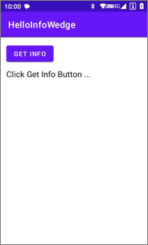
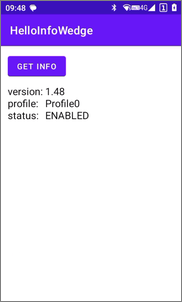

# Getting Started with InfoWedge APIs

> This sample application demonstrates how to start programming with the InfoWedge APIs.

[](README_zh-CN.md)

## Demonstration Environment

- InfoWedge - v1.48
- Device - MC62

## Overview

This sample application demonstrates how to start programming with the InfoWedge APIs. Run the sample application and click the `GET INFO` button to get some information about InfoWedge.




## Sample code walk-through

1. **Register broadcast receiver and filter results.** This is done in the `onCreate()` method of the sample application:
    ```java
    // Register broadcast receiver and filter results
    IntentFilter filter = new IntentFilter();
    filter.addAction("com.symbol.infowedge.api.RESULT_ACTION");
    filter.addCategory("android.intent.category.DEFAULT");
    registerReceiver(resultBroadcastReceiver, filter);
    ```
2. **Process the button click event.** This is done in the `onCreate()` method of the sample application:
    ```java
    Button btnGetInfo = findViewById(R.id.button_get_info);
    btnGetInfo.setOnClickListener(v -> {
        // Send multiple intents as extras to get different information
        Intent i = new Intent();
        i.setAction("com.symbol.infowedge.api.ACTION");

        // Gets the version number of InfoWedge currently installed on the device
        i.putExtra("com.symbol.infowedge.api.GET_VERSION_INFO", "");

        // Gets the status of InfoWedge as "enabled" or "disabled" as a string extra
        i.putExtra("com.symbol.infowedge.api.GET_INFOWEDGE_STATUS", "");

        // Gets the name of the Profile currently in use by InfoWedge
        i.putExtra("com.symbol.infowedge.api.GET_ACTIVE_PROFILE", "");

        sendBroadcast(i);
    });
    ```
3. **Define the broadcast receiver.** Get the information about InfoWedge in the `resultBroadcastReceiver` and display it in the screen. This is done in the sample application in MainActivity.java:
    ```java
    private BroadcastReceiver resultBroadcastReceiver = new BroadcastReceiver() {
        @Override
        public void onReceive(Context context, Intent intent) {
            StringBuilder sb = new StringBuilder();

            // Version number of InfoWedge
            if (intent.hasExtra("com.symbol.infowedge.api.RESULT_GET_VERSION_INFO")) {
                Bundle res = intent.getBundleExtra("com.symbol.infowedge.api.RESULT_GET_VERSION_INFO");
                String infoWedgeVersion = res.getString("INFOWEDGE");
                sb.append("version:\t").append(infoWedgeVersion).append("\n");
                Log.d(TAG, "version: " + infoWedgeVersion);
            }

            // The name of the Profile currently in use
            if (intent.hasExtra("com.symbol.infowedge.api.RESULT_GET_ACTIVE_PROFILE")) {
                String activeProfile = intent.getStringExtra("com.symbol.infowedge.api.RESULT_GET_ACTIVE_PROFILE");
                sb.append("profile:\t").append(activeProfile).append("\n");
                Log.d(TAG, "profile: " + activeProfile);
            }

            // The status of InfoWedge
            if (intent.hasExtra("com.symbol.infowedge.api.RESULT_GET_INFOWEDGE_STATUS")) {
                // status: "ENABLED" or "DISABLED"
                String infoWedgeStatus = intent.getStringExtra("com.symbol.infowedge.api.RESULT_GET_INFOWEDGE_STATUS");
                sb.append("status:\t").append(infoWedgeStatus).append("\n");
                Log.d(TAG, "status: " + infoWedgeStatus);
            }

            ((TextView)findViewById(R.id.label_info_data)).setText(sb.toString());
        }
    };
    ```