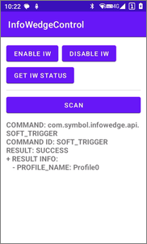

# InfoWedge 控制

> 该示例应用程序演示了如何使用 InfoWedge API 控制 Chainway 设备上的条码扫描器。

[](README.md)

## 演示环境

- InfoWedge - v1.48
- 设备 - MC62

## 概述

该示例应用程序演示了如何使用 InfoWedge API 控制 Chainway 设备上的条码扫描器。

1. 运行示例应用程序并点击 `ENABLE IW` 或 `DISABLE IW` 按钮以启用或禁用 InfoWedge 服务。
2. 点击 `GET IW STATUS` 按钮以获取 InfoWedge 的启用状态。
3. 点击 `SCAN` 按钮以开始或停止扫描。
4. 命令的结果将显示在按钮下方。



## 示例代码说明

1. **注册广播接收器并过滤结果。** 这是在示例应用程序的 `onCreate()` 方法中完成的：
    ```java
    // 注册广播接收器并过滤结果
    IntentFilter filter = new IntentFilter();
    filter.addAction("com.symbol.infowedge.api.RESULT_ACTION");
    filter.addCategory("android.intent.category.DEFAULT");
    registerReceiver(resultBroadcastReceiver, filter);
    ```
2. **处理按钮点击事件。** 这是在示例应用程序的 `onCreate()` 方法中完成的：
    ```java
    // 启用 InfoWedge
    Button btnEnableInfoWedge = findViewById(R.id.button_enable_iw);
    btnEnableInfoWedge.setOnClickListener(v -> {
        enableInfoWedge(true);
    });

    // 禁用 InfoWedge ...

    // 获取 InfoWedge 的状态 ...

    // 切换扫描
    Button btnToggleScan = findViewById(R.id.button_scan);
    btnToggleScan.setOnClickListener(v -> {
        toggleScan();
    });
    ```
3. **定义按钮点击处理程序。** 这是在示例应用程序的 MainActivity.java 中完成的：
    ```java
    private void enableInfoWedge(boolean enable) {
        // 启用或禁用 InfoWedge
        Intent i = new Intent();
        i.setAction("com.symbol.infowedge.api.ACTION");
        i.putExtra("com.symbol.infowedge.api.ENABLE_INFOWEDGE", enable);
        i.putExtra("SEND_RESULT", "true");
        i.putExtra("COMMAND_IDENTIFIER", "ENABLE_INFOWEDGE");
        sendBroadcast(i);
    }
    // 其他方法 ...
    ```
4. **定义广播接收器。** 在 `resultBroadcastReceiver` 中获取命令的结果并显示在屏幕上。这是在示例应用程序的 MainActivity.java 中完成的：
    ```java
    private BroadcastReceiver resultBroadcastReceiver = new BroadcastReceiver() {
        @Override
        public void onReceive(Context context, Intent intent) {
            StringBuilder sb = new StringBuilder();

            // InfoWedge 的状态
            if (intent.hasExtra("com.symbol.infowedge.api.RESULT_GET_INFOWEDGE_STATUS")) {
                // 状态："ENABLED" 或 "DISABLED"
                String infoWedgeStatus = intent.getStringExtra("com.symbol.infowedge.api.RESULT_GET_INFOWEDGE_STATUS");
                sb.append("INFO WEDGE STATUS: " + infoWedgeStatus + "\n");
            }

            // 命令的结果
            if (intent.hasExtra("COMMAND")) {
                String command = intent.getStringExtra("COMMAND");
                sb.append("COMMAND: " + command + "\n");
            }
            if (intent.hasExtra("COMMAND_IDENTIFIER")) {
                String commandId = intent.getStringExtra("COMMAND_IDENTIFIER");
                sb.append("COMMAND ID: " + commandId + "\n");
            }
            if (intent.hasExtra("RESULT")) {
                String result = intent.getStringExtra("RESULT");
                sb.append("RESULT: " + result + "\n");
            }
            if (intent.hasExtra("RESULT_INFO")) {
                sb.append("+ RESULT INFO:\n");
                Bundle bundle = intent.getBundleExtra("RESULT_INFO");
                for (String key : bundle.keySet()) {
                    sb.append("\t- " + key + ": " + bundle.get(key) + "\n");
                }
            }

            // 在屏幕上显示结果
            if (sb.length() > 0) {
                ((TextView) findViewById(R.id.label_result)).setText(sb);
            }
        }
    };
    ```