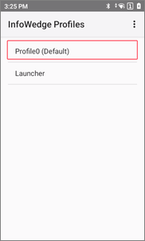
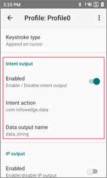
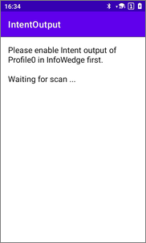
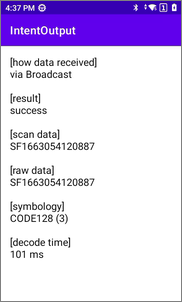
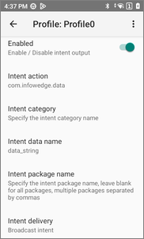
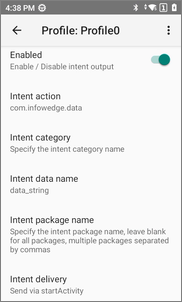
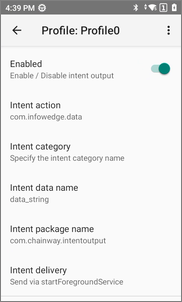

# Intent Output

> This example demonstrates how an application receives scan results via Android Intent.

[](README_zh-CN.md)

## Demonstration Environment

- InfoWedge - v1.71
- Device - MC62

## Overview

This example demonstrates how an application receives scan results via Android Intent. **Supports all four InfoWedge Intent delivery types:**

| Delivery Type | Receiving Method | Use Case |
|--------------|-----------------|----------|
| **0 - Broadcast** | Broadcast Receiver | Background receiving, best compatibility |
| **1 - Start Activity** | Activity Receiver | Bring app to foreground and display data |
| **2 - Start Service** | Service Receiver | Background processing (Android 7.1 and below) |
| **3 - Start Foreground Service** | Foreground Service | Background processing (Android 8.0+, requires notification) |

**Steps:**

1. Configure InfoWedge's `Profile0`, enable the Intent output feature, and select appropriate Delivery Type.

     

2. Run the sample application and scan a barcode. The application will display the following information:
    - How data was received (Broadcast / Activity / Service)
    - Scan result
    - Barcode data
    - Raw data
    - Barcode symbology
    - Decode time

     

## Sample Code Walk-through

### Method 1: Receiving via Broadcast (Delivery Type 0)

1. **Register the broadcast receiver.** When InfoWedge is configured to send broadcast intents, the application must register a broadcast receiver. This is done in the `onCreate()` method of the sample application:
    ```java
    // Register for the intent sent by InfoWedge
    IntentFilter filter = new IntentFilter();
    filter.addCategory(Intent.CATEGORY_DEFAULT);
    filter.addAction("com.infowedge.data");
    if (Build.VERSION.SDK_INT >= Build.VERSION_CODES.TIRAMISU) {
        registerReceiver(myBroadcastReceiver, filter, Context.RECEIVER_EXPORTED);
    } else {
        registerReceiver(myBroadcastReceiver, filter);
    }
    ```
2. **Define the broadcast receiver.** This is done in MainActivity.java of the sample application:
    ```java
    private BroadcastReceiver myBroadcastReceiver = new BroadcastReceiver() {
        @Override
        public void onReceive(Context context, Intent intent) {
            String action = intent.getAction();
            Bundle bundle = intent.getExtras();

            // output the contents of the intent to the log
            for (String key : bundle.keySet()) {
                Log.v(TAG, key + " : " + bundle.get(key));
            }

            if (action.equals("com.infowedge.data")) {
                // Received a barcode scan
                try {
                    // Update the text view on the screen with the data received
                    displayScanResult(intent, "via Broadcast");
                } catch (Exception e) {
                    // Catch if the UI does not exist when we receive the broadcast
                }
            }
        }
    };
    ```

3. **InfoWedge Intent Output Configuration**

    

### Method 2: Receiving via Activity (Delivery Type 1)

1. **Handle Intent received by Activity.** In the `onCreate()` method, handle the intent when activity is first created:
    ```java
    @Override
    protected void onCreate(Bundle savedInstanceState) {
        super.onCreate(savedInstanceState);
        setContentView(R.layout.activity_main);

        // Handle the initial intent when activity is first created
        displayScanResult(getIntent(), "via Activity (onCreate)");
        
        // ... broadcast receiver registration code ...
    }
    ```

2. **Configure Activity in AndroidManifest.xml.** An intent-filter must be added to receive intents from InfoWedge:
    ```xml
    <activity
        android:name=".MainActivity"
        android:launchMode="singleTop"
        android:exported="true">
        <intent-filter>
            <action android:name="android.intent.action.MAIN" />
            <category android:name="android.intent.category.LAUNCHER" />
        </intent-filter>
        <!-- Intent filter for InfoWedge Start Activity delivery -->
        <intent-filter>
            <action android:name="com.infowedge.data" />
            <!-- DEFAULT category is REQUIRED for implicit intents to work -->
            <category android:name="android.intent.category.DEFAULT" />
        </intent-filter>
    </activity>
    ```
    **Key Points:**
    - `android:launchMode="singleTop"` - Ensures `onNewIntent()` is called when activity exists instead of creating new instance
    - `<category android:name="android.intent.category.DEFAULT" />` - Required for implicit intents

3. **Implement onNewIntent() method.** When Activity is in singleTop mode, new intents trigger this method:
    ```java
    @Override
    protected void onNewIntent(Intent intent) {
        super.onNewIntent(intent);
        // Handle new intent when activity is reused (due to singleTop launch mode)
        setIntent(intent);  // Update the current intent
        displayScanResult(intent, "via Activity (onNewIntent)");
    }
    ```

4. **InfoWedge Intent Output Configuration**

    

### Method 3: Receiving via Service (Delivery Type 2 or 3)

1. **Create Service class.** Create `ScanDataService.java` to receive scan data from InfoWedge:
    ```java
    public class ScanDataService extends Service {
        private static final String TAG = "ScanDataService";
        public static final String ACTION_DISPLAY_SCAN_DATA = 
            "com.chainway.intentoutput.DISPLAY_SCAN_DATA";

        @Override
        public int onStartCommand(Intent intent, int flags, int startId) {
            // IMPORTANT: Must call startForeground() within 5 seconds on Android 8.0+
            if (Build.VERSION.SDK_INT >= Build.VERSION_CODES.O) {
                startForeground(NOTIFICATION_ID, createNotification("Service is running"));
            }

            // Process the intent from InfoWedge
            if (intent != null && "com.infowedge.data".equals(intent.getAction())) {
                processScanData(intent);
            }

            stopSelf(startId);
            return START_NOT_STICKY;
        }

        private void processScanData(Intent intent) {
            // Extract and log scan data
            int result = intent.getIntExtra("result", -1);
            if (result == 1) {
                String dataString = intent.getStringExtra("data_string");
                // ... process data ...
                
                // Forward to MainActivity for display
                forwardToMainActivity(intent);
            }
        }
    }
    ```

2. **Register Service in AndroidManifest.xml:**
    ```xml
    <!-- Permission required for foreground service on Android 9.0+ -->
    <uses-permission android:name="android.permission.FOREGROUND_SERVICE" />
    <uses-permission android:name="android.permission.FOREGROUND_SERVICE_DATA_SYNC" />

    <service
        android:name=".ScanDataService"
        android:exported="true"
        android:foregroundServiceType="dataSync">
        <intent-filter>
            <action android:name="com.infowedge.data" />
        </intent-filter>
    </service>
    ```

3. **Register receiver for data forwarded from Service.** In MainActivity's `onCreate()` method:
    ```java
    // Register for broadcasts from ScanDataService
    IntentFilter serviceFilter = new IntentFilter();
    serviceFilter.addAction(ScanDataService.ACTION_DISPLAY_SCAN_DATA);
    if (Build.VERSION.SDK_INT >= Build.VERSION_CODES.TIRAMISU) {
        registerReceiver(serviceDataReceiver, serviceFilter, Context.RECEIVER_NOT_EXPORTED);
    } else {
        registerReceiver(serviceDataReceiver, serviceFilter);
    }
    ```

4. **Define receiver to handle forwarded data from Service:**

    ```java
    // Receiver for data forwarded from ScanDataService
    private BroadcastReceiver serviceDataReceiver = new BroadcastReceiver() {
        @Override
        public void onReceive(Context context, Intent intent) {
            if (ScanDataService.ACTION_DISPLAY_SCAN_DATA.equals(intent.getAction())) {
                Log.d(TAG, "Received scan data from ScanDataService");
                try {
                    displayScanResult(intent, "via Service (forwarded to Activity)");
                } catch (Exception e) {
                    Log.e(TAG, "Error displaying scan result from service", e);
                }
            }
        }
    };
    ```

5. **InfoWedge Intent Output Configuration**

    Need to set `Intent package name` to `com.chainway.intentoutput`, otherwise the data cannot be received.

    

### Common Method: Display Scan Data

**Extract scanned data and display it on screen.** The `displayScanResult()` method handles data from all receiving methods:
```java
private void displayScanResult(Intent intent, String howDataReceived) {
    // Check if this is a valid scan data intent
    String action = intent.getAction();
    if (action == null) return;
    
    // Accept data from InfoWedge directly or forwarded from ScanDataService
    if (!action.equals("com.infowedge.data") && 
        !action.equals(ScanDataService.ACTION_DISPLAY_SCAN_DATA)) {
        return;
    }

    final TextView lblScanData = (TextView) findViewById(R.id.lblScanData);
    StringBuilder sb = new StringBuilder();

    // How the data was received
    sb.append("[how data received]\n").append(howDataReceived).append("\n\n");

    // Extract the result of the scan
    int result = intent.getIntExtra("result", -1);
    switch (result) {
        case 1:
            sb.append("[result]\n").append("success").append("\n\n");
            break;
        case -1:
            sb.append("[result]\n").append("cancel").append("\n\n");
            break;
        default:
            sb.append("[result]\n").append("failure").append("\n\n");
            break;
    }

    if (result != 1) {
        // Update the text view on the screen with the data received
        lblScanData.setText(sb.toString());
        return;
    }

    // Extract the data of the scan result
    sb.append("[scan data]\n").append(intent.getStringExtra("data_string")).append("\n\n");

    // Extract the raw data from the intent
    byte[] decode_data = intent.getByteArrayExtra("decode_data");
    if (decode_data != null) {
        sb.append("[raw data]\n").append(new String(decode_data)).append("\n\n");
    }

    // Extract the symbology of the barcode
    int symbol = intent.getIntExtra("symbology", -1);
    if (symbol == -1) {
        sb.append("[symbology]\nunknown\n\n");
    } else {
        sb.append("[symbology]\n").append(BarcodeSymbol.getSymbolName(symbol))
                .append(" (").append(symbol).append(")").append("\n\n");
    }

    // Extract the time it took to decode the barcode
    sb.append("[decode time]\n").append(intent.getIntExtra("decode_time", -1)).append(" ms\n\n");

    // Update the text view on the screen with the data received
    lblScanData.setText(sb.toString());
}
```

## InfoWedge Configuration Guide

### Delivery Type Selection

| Delivery Type | Recommended For | Notes |
|--------------|-----------------|-------|
| **0 - Broadcast** | ✅ Recommended for general use | Most stable, best compatibility, app doesn't need to be in foreground |
| **1 - Start Activity** | Bring app to foreground | Interrupts user's current operation |
| **2 - Start Service** | Background processing (older Android) | Limited on Android 8.0+, code automatically falls back to foreground service |
| **3 - Start Foreground Service** | Background processing (newer Android) | Requires notification, must call startForeground() within 5 seconds |

### Configuration Parameters

```
Intent Output:
  - Enable: true
  - Action: com.infowedge.data
  - Category: android.intent.category.DEFAULT (optional)
  - Package Name: com.chainway.intentoutput
  - Delivery Type: 0/1/2/3 (select based on your needs)
```

## Data Fields Description

Scan data fields included in the Intent:

| Field Name | Type | Description |
|-----------|------|-------------|
| `result` | int | Scan result: 1=success, -1=cancel, other=failure |
| `data_string` | String | Scan data (as string) |
| `decode_data` | byte[] | Raw byte data |
| `symbology` | int | Barcode type code |
| `decode_time` | int | Decode time (milliseconds) |

