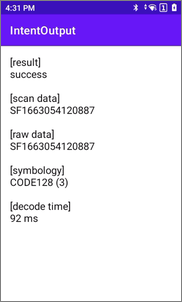

# Intent 输出

> 本示例演示了应用程序如何通过 Android Intent 接收扫码结果

[](README.md)

## 演示环境

- InfoWedge - v1.48
- 设备 - MC62

## 概述

本示例演示了应用程序如何通过 Android Intent 来接收扫码结果。操作步骤如下：

1. 配置 InfoWedge 的 Profile0 ，打开 Intent 输出功能。

     

2. 运行示例应用程序，扫描条码。应用程序将显示以下信息：
   - 扫码结果
   - 条码数据
   - 原始数据
   - 条码类型
   - 扫码时长

     

## 示例代码说明

1. **注册广播接收器。** 由于 InfoWedge 配置为发送广播 intent，因此应用程序必须注册广播接收器。这是在示例应用程序的 onCreate（） 方法中完成的：
    ```java
    protected void onCreate(Bundle savedInstanceState) {
        super.onCreate(savedInstanceState);
        setContentView(R.layout.activity_main);

        // 注册 InfoWedge 发送的 intent
        IntentFilter filter = new IntentFilter();
        filter.addCategory(Intent.CATEGORY_DEFAULT);
        filter.addAction("com.infowedge.data");
        registerReceiver(myBroadcastReceiver, filter);
    }
    ```
2. **定义广播接收器。** 这是在示例应用程序中以 MainActivity.java 完成的：
    ```java
    private BroadcastReceiver myBroadcastReceiver = new BroadcastReceiver() {
        @Override
        public void onReceive(Context context, Intent intent) {
            String action = intent.getAction();
            Bundle bundle = intent.getExtras();

            // 将 intent 的内容输出到日志
            for (String key : bundle.keySet()) {
                Log.v(TAG, key + " : " + bundle.get(key));
            }

            if (action.equals("com.infowedge.data")) {
                // 收到条码扫描结果
                try {
                    // 使用接收到的数据更新屏幕上的文本信息
                    displayScanResult(intent);
                } catch (Exception e) {
                    // 捕获在接收广播时 UI 不存在的情况
                }
            }
        }
    };
    ```
3. **提取扫描的数据并将其显示在屏幕上。** 这是在示例应用程序的 displayScanResult（） 方法中完成的：
    ```java
    private void displayScanResult(Intent intent) {
        final TextView lblScanData = (TextView) findViewById(R.id.lblScanData);
        StringBuilder sb = new StringBuilder();

        // 提取扫描结果
        int result = intent.getIntExtra("result", -1);
        switch (result) {
            case 1:
                sb.append("[result]\n").append("success").append("\n\n");
                break;
            case -1:
                sb.append("[result]\n").append("cancel").append("\n\n");
                break;
            default:
                sb.append("[result]\n").append("failure").append("\n\n");
                break;
        }

        if (result != 1) {
            // 使用接收到的数据更新屏幕上的文本信息
            lblScanData.setText(sb.toString());
            return;
        }

        // 提取扫码数据
        sb.append("[scan data]\n").append(intent.getStringExtra("data_string")).append("\n\n");

        // 从 intent 中提取原始数据
        byte[] decode_data = intent.getByteArrayExtra("decode_data");
        if (decode_data != null) {
            sb.append("[raw data]\n").append(new String(decode_data)).append("\n\n");
        }

        // 提取条码类型
        int symbol = intent.getIntExtra("symbology", -1);
        if (symbol == -1) {
            sb.append("[symbology]\nunknown\n\n");
        } else {
            sb.append("[symbology]\n").append(BarcodeSymbol.getSymbolName(symbol))
                    .append(" (").append(symbol).append(")").append("\n\n");
        }

        // 提取解码所花费的时间
        sb.append("[decode time]\n").append(intent.getIntExtra("decode_time", -1)).append(" ms\n\n");

        // 使用接收到的数据更新屏幕上的文本信息
        lblScanData.setText(sb.toString());
    }
    ```
