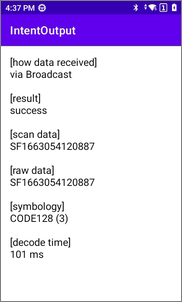
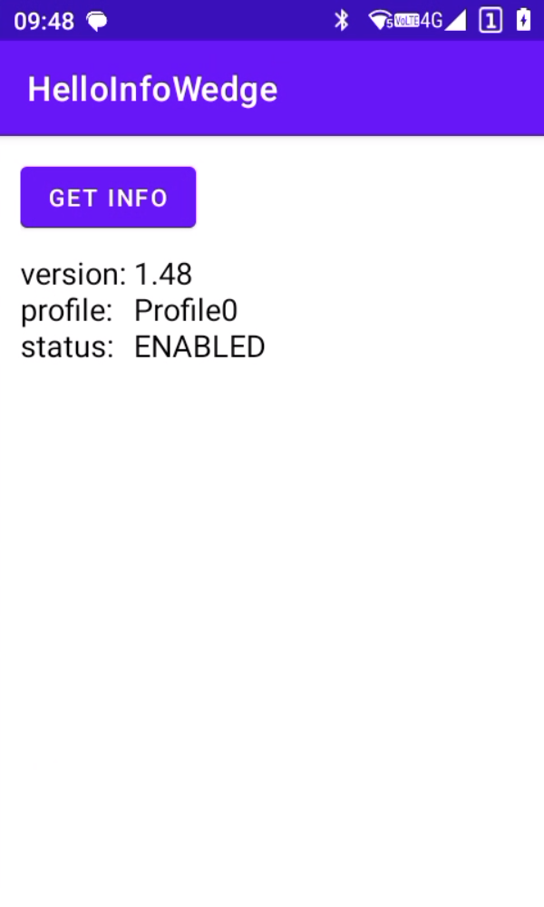

# Infowedge 编程示例

> 该仓库包含示例应用程序，演示如何使用成为 InfoWedge 与 成为设备上的扫码器进行交互。

该仓库包含以下示例应用程序：

- **[IntentOutput](IntentOutput/README_zh-CN.md)：** 演示了应用程序如何通过 Android Intent 接收扫描结果。

- **[HelloInfoWedge](HelloInfoWedge/README_zh-CN.md)：** 演示了如何开始使用 InfoWedge API 进行编程。

