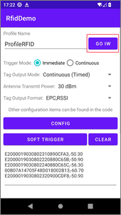
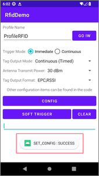
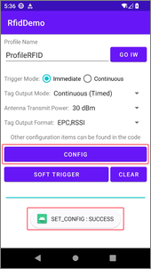
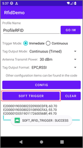

# Rfid Demo

> This is a demo project to show how to configure the InfoWedge profile's RFID configuration items using the APIs.

[](README_zh-CN.md)

## Demonstration Environment

- InfoWedge - v1.50
- Device - C72 (Android13)
- RFID Hardware version - v2.0.2
- RFID Software version - v6.1.8

## Overview

This sample application demonstrates how to configure the InfoWedge profile's RFID configuration items using the InfoWedge APIs.


1. Click the `GO IW` button to go to the InfoWedge app.
2. Select `Trigger Mode`, `Tag Output Mode`, `Antenna Transmit Power`, and `Tag Output Format` parameters.
3. Click the `CONFIG` button to set the RFID module parameters.
4. Click the `SOFT TRIGGER` button to trigger the RFID module scan.
5. Click the `CLEAR` button to clear the RFID module scan results.

## Sample code walk-through

### Overview

1. **Register broadcast receiver and filter results.** This is done in the `onCreate()` method of the sample application:
    ```java
    // Register broadcast receiver and filter results
    IntentFilter filter = new IntentFilter();
    filter.addAction("com.symbol.infowedge.api.RESULT_ACTION");
    filter.addCategory("android.intent.category.DEFAULT");
    registerReceiver(resultBroadcastReceiver, filter);
    ```
2. **Process the button click event.** This is done in the `onCreate()` method of the sample application:
    ```java
    // set default values
    Spinner spinner = findViewById(R.id.spinner_tag_output_mode);
    spinner.setSelection(1);    // Continuous (Timed)
    spinner = findViewById(R.id.spinner_transmit_power);
    spinner.setSelection(23);   // 28 dBm

    // set up the buttons
    findViewById(R.id.button_go_iw).setOnClickListener(v -> goInfoWedge());
    findViewById(R.id.button_config_rfid_items).setOnClickListener(v -> configRfidItems());
    findViewById(R.id.button_soft_trigger).setOnClickListener(v -> softTrigger());
    findViewById(R.id.button_clear_edit_result).setOnClickListener(v -> clearEditResult());
    ```
3. **Define the button click handlers.** This is done in the sample application in MainActivity.java:
    ```
    private void goInfoWedge() {
        Intent i = new Intent();
        i.setClassName("com.rscja.infowedge", "com.rscja.infowedge.ui.MainActivity");
        startActivity(i);
    }
    // some other methods ...
    ```
    Click the `GO IW` button to go to the InfoWedge app, this helps to check the configurations in the InfoWedge app.

     

4. **Define the broadcast receiver.** Get the result of the command in the `resultBroadcastReceiver` and show it on the screen. This is done in the sample application in MainActivity.java:
    ```java
    // broadcast receiver to receive the results
    private BroadcastReceiver resultBroadcastReceiver = new BroadcastReceiver() {
        @Override
        public void onReceive(Context context, Intent intent) {
            // The result of the command
            if (intent.hasExtra("COMMAND_IDENTIFIER") && intent.hasExtra("RESULT")) {
                Toast.makeText(
                        context,
                        intent.getStringExtra("COMMAND_IDENTIFIER")
                                + " : "
                                + intent.getStringExtra("RESULT"),
                        Toast.LENGTH_SHORT
                ).show();
            }
        }
    };
    ```

    

### Config RFID input parameters

config RFID input parameters of the profile.

```java
private void configRfidItems() {
    String profileName = ((TextView) findViewById(R.id.edit_profile_name)).getText().toString();
    if (profileName.isEmpty()) {
        Toast.makeText(this, "Profile name cannot be empty", Toast.LENGTH_SHORT).show();
        return;
    }

    // main parameters
    Bundle bMain = new Bundle();
    bMain.putString("PROFILE_NAME", profileName);   // profile name
    bMain.putString("PROFILE_ENABLED", "true");     // enable the profile
    // CONFIG_MODE can be one of the following:
    // CREATE_IF_NOT_EXIST: create the profile if it does not exist
    // OVERWRITE: restore the profile to default first if it exists
    // UPDATE : merge the configuration with the existing one
    bMain.putString("CONFIG_MODE", "CREATE_IF_NOT_EXIST");  // Create the profile if it does not exist

    // associate the app with the profile
    Bundle bundleApp = new Bundle();
    bundleApp.putString("PACKAGE_NAME", getPackageName());   // package name of the app
    bundleApp.putStringArray("ACTIVITY_LIST", new String[]{"*"}); // * means all activities
    bMain.putParcelableArray("APP_LIST", new Bundle[]{bundleApp});

    // Disable the barcode input plugin
    Bundle bBarcodeConfig = new Bundle();
    bBarcodeConfig.putString("PLUGIN_NAME", "BARCODE");
    Bundle bBarcodeParams = new Bundle();
    bBarcodeParams.putString("barcode_enabled", "false");   // disable barcode
    bBarcodeConfig.putBundle("PARAM_LIST", bBarcodeParams);
    bMain.putBundle("PLUGIN_CONFIG", bBarcodeConfig);

    // Set RFID configurations
    Bundle bRfidConfig = new Bundle();
    bRfidConfig.putString("PLUGIN_NAME", "RFID");     // plugin name
    Bundle bRfidParams = new Bundle();
    bRfidParams.putString("rfid_input_enabled", "true");   // enable RFID
    bRfidParams.putString("rfid_trigger_keys", "LEFT_TRIGGER,CENTER_TRIGGER,RIGHT_TRIGGER,SCAN,GUN_TRIGGER");  // trigger keys
    bRfidParams.putString("rfid_beeper_enable", "true");    // enable beeper
    bRfidParams.putString("rfid_timed_output_interval", "200"); // timed output interval

    bRfidParams.putString("rfid_filter_duplicate_tags", "true"); // filter duplicate tags
    bRfidParams.putString("rfid_frequency_mode", "2"); // frequency mode, 2-CHN, 4-ETSI, 8-USA
    bRfidParams.putString("rfid_tag_read_duration", "2000"); // tag read duration, 0, 100~60000 (ms)
    bRfidParams.putString("rfid_separator_to_tags", "\\n"); // separator to tags when multiple tags are read
    bRfidParams.putString("rfid_epc_user_data_type", "0"); // EPC and USER data type，0-Hex，1-ASCII

    bRfidParams.putString("rfid_pre_filter_enable", "false"); // disable pre-filter function
    bRfidParams.putString("rfid_pre_filter_memory_bank", "1"); // pre-filter memory bank, 1-EPC, 2-TID, 3-User
    bRfidParams.putString("rfid_pre_filter_offset", "4"); // pre-filter offset
    bRfidParams.putString("rfid_pre_filter_tag_pattern", "E012"); // pre-filter tag pattern

    bRfidParams.putString("rfid_post_filter_enable", "false"); // disable post-filter function
    bRfidParams.putString("rfid_post_filter_no_of_tags_to_read", "1"); // number of tags to read
    bRfidParams.putString("rfid_post_filter_rssi", "-80"); // RSSI threshold, -100~0 (dBm)

    RadioGroup rgTriggerMode = findViewById(R.id.radio_group_trigger_mode);
    int triggerModeId = rgTriggerMode.getCheckedRadioButtonId();
    int triggerModeIndex = 0;
    for (int i = 0; i < rgTriggerMode.getChildCount(); i++) {
        if (rgTriggerMode.getChildAt(i).getId() == triggerModeId) {
            triggerModeIndex = i;
            break;
        }
    }
    bRfidParams.putString("rfid_trigger_mode", String.valueOf(triggerModeIndex));    // trigger mode, 0-immediate, 1-continuous

    Spinner spinnerOutputMode = findViewById(R.id.spinner_tag_output_mode);
    int outputMode = spinnerOutputMode.getSelectedItemPosition();
    bRfidParams.putString("rfid_output_mode", String.valueOf(outputMode)); // output mode, 0-single tag, 1-timed, 2-one time, 3-RSSI first

    Spinner spinnerOutputFormat = findViewById(R.id.spinner_tag_output_format);
    String outputFormat = spinnerOutputFormat.getSelectedItem().toString();
    bRfidParams.putString("rfid_tag_output_data_format", outputFormat); // tag output data format: PC, TID, EPC, USER[start,offset], RSSI

    Spinner spinnerTransmitPower = findViewById(R.id.spinner_transmit_power);
    String transmitPower = spinnerTransmitPower.getSelectedItem().toString();
    transmitPower = transmitPower.replace("dBm", "").trim();
    bRfidParams.putString("rfid_antenna_transmit_power", transmitPower); // transmit power, 5~30 (dBm)

    bRfidConfig.putBundle("PARAM_LIST", bRfidParams);

    // add plugin configurations to the main bundle
    ArrayList<Bundle> bundlePluginConfig = new ArrayList<>();
    bundlePluginConfig.add(bBarcodeConfig);
    bundlePluginConfig.add(bRfidConfig);
    bMain.putParcelableArrayList("PLUGIN_CONFIG", bundlePluginConfig);

    Intent i = new Intent();
    i.setAction("com.symbol.infowedge.api.ACTION");
    i.putExtra("com.symbol.infowedge.api.SET_CONFIG", bMain);
    i.putExtra("SEND_RESULT", "true");
    i.putExtra("COMMAND_IDENTIFIER", "SET_CONFIG");
    sendBroadcast(i);
}
```



### Soft trigger

Soft trigger the RFID module to scan.

```java
private void softTrigger() {
    Intent i = new Intent();
    i.setAction("com.symbol.infowedge.api.ACTION");
    i.putExtra("com.symbol.infowedge.api.SOFT_RFID_TRIGGER", "TOGGLE"); // START, STOP, TOGGLE
    i.putExtra("SEND_RESULT", "true");
    i.putExtra("COMMAND_IDENTIFIER", "SOFT_RFID_TRIGGER");
    sendBroadcast(i);

    findViewById(R.id.edit_output_result).requestFocus();
}
```


