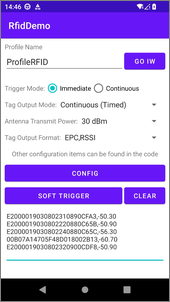
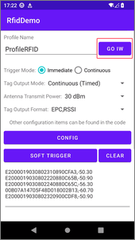
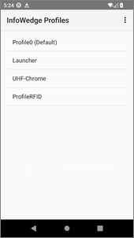
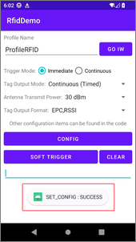
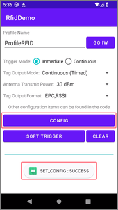
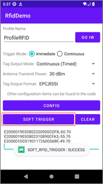

# RFID 演示

> 本演示项目展示如何使用 API 配置 InfoWedge 配置文件的 RFID 配置项。

[](README.md)

## 演示环境

- InfoWedge - v1.50
- 设备 - C72 (Android13)
- RFID 硬件版本 - v2.0.2
- RFID 软件版本 - v6.1.8

## 概述

此示例应用程序演示了如何使用 InfoWedge API 配置 InfoWedge 配置文件的 RFID 配置项。



1. 点击 `GO IW` 按钮跳转到 InfoWedge 应用程序。
2. 选择 `按键触发方式`、`标签输出模式`、`天线发射功率` 和 `标签数据输出格式` 参数。
3. 点击 `CONFIG` 按钮设置 RFID 模块参数。
4. 点击 `SOFT TRIGGER` 按钮触发 RFID 模块扫描。
5. 点击 `CLEAR` 按钮清除 RFID 模块扫描结果。

## 示例代码说明

### 概述

1. **注册广播接收器并过滤结果。** 这是在示例应用程序的 `onCreate()` 方法中完成的：
    ```java
    // 注册广播接收器并过滤结果
    IntentFilter filter = new IntentFilter();
    filter.addAction("com.symbol.infowedge.api.RESULT_ACTION");
    filter.addCategory("android.intent.category.DEFAULT");
    registerReceiver(resultBroadcastReceiver, filter);
    ```
2. **处理按钮点击事件。** 这是在示例应用程序的 `onCreate()` 方法中完成的：
    ```java
    // 设置默认值
    Spinner spinner = findViewById(R.id.spinner_tag_output_mode);
    spinner.setSelection(1);    // 持续（定时）
    spinner = findViewById(R.id.spinner_transmit_power);
    spinner.setSelection(23);   // 28 dBm

    // 设置按钮
    findViewById(R.id.button_go_iw).setOnClickListener(v -> goInfoWedge());
    findViewById(R.id.button_config_rfid_items).setOnClickListener(v -> configRfidItems());
    findViewById(R.id.button_soft_trigger).setOnClickListener(v -> softTrigger());
    findViewById(R.id.button_clear_edit_result).setOnClickListener(v -> clearEditResult());
    ```
3. **定义按钮点击处理程序。** 这是在示例应用程序的 MainActivity.java 中完成的：
    ```
    private void goInfoWedge() {
        Intent i = new Intent();
        i.setClassName("com.rscja.infowedge", "com.rscja.infowedge.ui.MainActivity");
        startActivity(i);
    }
    // ... 其它代码 ...
    ```
    点击 `GO IW` 按钮进入 InfoWedge 应用程序，便于检查 InfoWedge 应用程序中的配置项。

     

4. **定义广播接收器。** 在 `resultBroadcastReceiver` 中获取命令的结果并显示在屏幕上。这是在示例应用程序的 MainActivity.java 中完成的：
    ```java
    // 广播接收器接收结果
    private BroadcastReceiver resultBroadcastReceiver = new BroadcastReceiver() {
        @Override
        public void onReceive(Context context, Intent intent) {
            // 命令的结果
            if (intent.hasExtra("COMMAND_IDENTIFIER") && intent.hasExtra("RESULT")) {
                Toast.makeText(
                        context,
                        intent.getStringExtra("COMMAND_IDENTIFIER")
                                + " : "
                                + intent.getStringExtra("RESULT"),
                        Toast.LENGTH_SHORT
                ).show();
            }
        }
    };
    ```

    

### 配置 RFID 输入参数

配置配置文件的 RFID 输入参数。

```java
private void configRfidItems() {
    String profileName = ((TextView) findViewById(R.id.edit_profile_name)).getText().toString();
    if (profileName.isEmpty()) {
        Toast.makeText(this, "配置文件名称不能为空", Toast.LENGTH_SHORT).show();
        return;
    }

    // 主要参数
    Bundle bMain = new Bundle();
    bMain.putString("PROFILE_NAME", profileName);   // 配置文件名称
    bMain.putString("PROFILE_ENABLED", "true");     // 启用配置文件
    // CONFIG_MODE 可以是以下之一：
    // CREATE_IF_NOT_EXIST: 如果配置文件不存在则创建
    // OVERWRITE: 如果配置文件存在则先恢复默认
    // UPDATE : 与现有配置合并
    bMain.putString("CONFIG_MODE", "CREATE_IF_NOT_EXIST");  // 如果配置文件不存在则创建

    // 将应用程序与配置文件关联
    Bundle bundleApp = new Bundle();
    bundleApp.putString("PACKAGE_NAME", getPackageName());   // 应用程序包名
    bundleApp.putStringArray("ACTIVITY_LIST", new String[]{"*"}); // * 表示所有活动
    bMain.putParcelableArray("APP_LIST", new Bundle[]{bundleApp});

    // 禁用扫码码输入插件
    Bundle bBarcodeConfig = new Bundle();
    bBarcodeConfig.putString("PLUGIN_NAME", "BARCODE");
    Bundle bBarcodeParams = new Bundle();
    bBarcodeParams.putString("barcode_enabled", "false");   // 禁用扫码
    bBarcodeConfig.putBundle("PARAM_LIST", bBarcodeParams);
    bMain.putBundle("PLUGIN_CONFIG", bBarcodeConfig);

    // 设置 RFID 配置
    Bundle bRfidConfig = new Bundle();
    bRfidConfig.putString("PLUGIN_NAME", "RFID");     // 插件名称
    Bundle bRfidParams = new Bundle();
    bRfidParams.putString("rfid_input_enabled", "true");   // 启用 RFID
    bRfidParams.putString("rfid_trigger_keys", "LEFT_TRIGGER,CENTER_TRIGGER,RIGHT_TRIGGER,SCAN,GUN_TRIGGER");  // 触发键
    bRfidParams.putString("rfid_beeper_enable", "true");    // 提示音
    bRfidParams.putString("rfid_timed_output_interval", "200"); // 定时输出间隔

    bRfidParams.putString("rfid_filter_duplicate_tags", "true"); // 过滤重复标签
    bRfidParams.putString("rfid_frequency_mode", "2"); // 频率模式，2-CHN, 4-ETSI, 8-USA
    bRfidParams.putString("rfid_tag_read_duration", "2000"); // 标签读取持续时间，0, 100~60000 (ms)
    bRfidParams.putString("rfid_separator_to_tags", "\\n"); // 多个标签读取时的分隔符
    bRfidParams.putString("rfid_epc_user_data_type", "0"); // EPC 和 USER 数据类型，0-十六进制，1-ASCII

    bRfidParams.putString("rfid_pre_filter_enable", "false"); // 禁用预过滤器
    bRfidParams.putString("rfid_pre_filter_memory_bank", "1"); // 预过滤器存储区类型，1-EPC, 2-TID, 3-User
    bRfidParams.putString("rfid_pre_filter_offset", "4"); // 预过滤器偏移字节数
    bRfidParams.putString("rfid_pre_filter_tag_pattern", "E012"); // 预过滤器标签过滤模式

    bRfidParams.putString("rfid_post_filter_enable", "false"); // 禁用后过滤器
    bRfidParams.putString("rfid_post_filter_no_of_tags_to_read", "1"); // 读取的标签数量
    bRfidParams.putString("rfid_post_filter_rssi", "-80"); // RSSI 阈值，-100~0 (dBm)

    RadioGroup rgTriggerMode = findViewById(R.id.radio_group_trigger_mode);
    int triggerModeId = rgTriggerMode.getCheckedRadioButtonId();
    int triggerModeIndex = 0;
    for (int i = 0; i < rgTriggerMode.getChildCount(); i++) {
        if (rgTriggerMode.getChildAt(i).getId() == triggerModeId) {
            triggerModeIndex = i;
            break;
        }
    }
    bRfidParams.putString("rfid_trigger_mode", String.valueOf(triggerModeIndex));    // 触发模式，0-接住，1-连续

    Spinner spinnerOutputMode = findViewById(R.id.spinner_tag_output_mode);
    int outputMode = spinnerOutputMode.getSelectedItemPosition();
    bRfidParams.putString("rfid_output_mode", String.valueOf(outputMode)); // 输出模式，0-持续(单标签)，1-持续(定时)，2-单次，3-信号优先

    Spinner spinnerOutputFormat = findViewById(R.id.spinner_tag_output_format);
    String outputFormat = spinnerOutputFormat.getSelectedItem().toString();
    bRfidParams.putString("rfid_tag_output_data_format", outputFormat); // 标签数据输出数据格式：PC, TID, EPC, USER[start,offset], RSSI

    Spinner spinnerTransmitPower = findViewById(R.id.spinner_transmit_power);
    String transmitPower = spinnerTransmitPower.getSelectedItem().toString();
    transmitPower = transmitPower.replace("dBm", "").trim();
    bRfidParams.putString("rfid_antenna_transmit_power", transmitPower); // 发射功率，5~30 (dBm)

    bRfidConfig.putBundle("PARAM_LIST", bRfidParams);

    // 将插件配置添加到主包中
    ArrayList<Bundle> bundlePluginConfig = new ArrayList<>();
    bundlePluginConfig.add(bBarcodeConfig);
    bundlePluginConfig.add(bRfidConfig);
    bMain.putParcelableArrayList("PLUGIN_CONFIG", bundlePluginConfig);

    Intent i = new Intent();
    i.setAction("com.symbol.infowedge.api.ACTION");
    i.putExtra("com.symbol.infowedge.api.SET_CONFIG", bMain);
    i.putExtra("SEND_RESULT", "true");
    i.putExtra("COMMAND_IDENTIFIER", "SET_CONFIG");
    sendBroadcast(i);
}
```



### 软件触发

软件触发 RFID 模块进行扫描。

```java
private void softTrigger() {
    Intent i = new Intent();
    i.setAction("com.symbol.infowedge.api.ACTION");
    i.putExtra("com.symbol.infowedge.api.SOFT_RFID_TRIGGER", "TOGGLE"); // START, STOP, TOGGLE
    i.putExtra("SEND_RESULT", "true");
    i.putExtra("COMMAND_IDENTIFIER", "SOFT_RFID_TRIGGER");
    sendBroadcast(i);

    findViewById(R.id.edit_output_result).requestFocus();
}
```


